# 😀 리액트 챕터별 주요내용 정리

## 2장 JSX

### ⛑️ import 구문으로 특정파일을 불러올 수 있다.

```javascript
import logo from './logo.svg';
import './App.css';
```

##### 이처럼 모듈을 불러와서 사용하는 것은 원래 브라우저에 없던 기능이며 node.js에서 지원하는 기능이다.

node.js에서의 기능을 브라우저에서 사용할 수 있도록 bundler를 사용한다. 파일을 묶듯이 모듈들을 연결하는 것이다.

#### ⛓️ 대표적인 번들러
대표적인 번들러로는 웹팩, Parcel, browserify라는 도구들이 있다. 

##### react project에서는 webpack을 주로 사용한다.

#### 🤔 그러면 번들러를 왜쓸까?
프로젝트를 개발하면서 여러 모듈들을 불러오는데 불러온 모듈을 모두 합쳐서 하나의 파일을 생성할 수 있도록 해준다.
또한 최적화 과정에서 여러 개의 파일로 분리도 함


src/index.js를 시작으로 필요한 파일을 번들링함

#### 🤔 webpack을 왜씀

웹팩으로 svg, css파일등을 불러와서 사용가능하다. 이러한 파일들을 불러오는 것은 웹팩의 loader가 담당하는데 예를들어
css파일은 css-loader가 file-loader는 폰드등을 불러올 수 있으며 babel-loader는 최신 자바스크립트 문법으로 작성된 코드를 babel이라는 도구를 통해 ES5문법으로 변환해준다.

#### 🤔 왜 최신 js코드를 ES5로 변환하는가
결론부터 말하면 구버전 웹 브라우저와 호환하기 위해서이다. 또한 JSX는 자바스크립트 정식 문법이 아니므로 ES5형태로 변환해야한다.

#### 암튼 webpack은 CRA할때 알아서 설치 및 설정해준다.

### 👨‍🏫 JSX란 무엇인가
JSX는 자바스크립트 확장 문법이다. babel-bundler가 코드를 일반자바스크립트 형태(ES5형태)로 변환해준다.

```js
import logo from './logo.svg';
import './App.css';

function App() {
  return (
    <div className="App">
      <header className="App-header">
        
        <p>
          Edit <code>src/App.js</code> and save to reload.
        </p>
        <a
          className="App-link"
          href="https://reactjs.org"
          target="_blank"
          rel="noopener noreferrer"
        >
          Learn React
        </a>
      </header>
    </div>
  );
}

export default App;

```
얼핏보면 html코드인 것 같지만 내부적으로 일반 자바스크립트 코드로 변환해주는 과정이 있어 편하게 코딩이 가능하다.

### index.js에서의 root와 root.render
```js
const root = ReactDOM.createRoot(document.getElementById('root'));
root.render(
  <React.StrictMode>
    <App />
  </React.StrictMode>
);

```

root는 렌더링 할 곳이며 root.render내부의 컴포넌트는 렌더링 할 대상이다.

### 🥃 간단한 문법, 규칙

#### 1. component 감싸기
```js
function App() {
  return (
    <div className="App">
      <h1>Hello, world!</h1>
    </div>
  );
}
```

##### 잘못된 예시)
```js
function App() {
  return (
      <h1>Hello, world1!</h1>
      <h1>Hello, world2!</h1>
  );
}
```
위 코드는 component를 부모요소로 감싸지 않았으므로 오류가 나타난다.

##### fragment이용하기
```js
import { Fragment } from 'react';
...
function App() {
  return (
    <Fragment>
      <h1>Hello, world1!</h1>
      <h1>Hello, world2!</h1>
    </Fragment>
  );
}
```

#### 2. DOM에 자바스크립트 표현삽입하기
```js
import logo from './logo.svg';
import './App.css';
import { Fragment } from 'react';

function App() {
  const name = "리액트";
  return (
    <Fragment>
      <h1>Hello, world1!</h1>
      <h1>Hello, world2!</h1>
      <h2>{name}</h2>
    </Fragment>
  );
}

export default App;

```


모달 박스 만들기

modal 값이 off인 경우
```js
import logo from './logo.svg';
import './App.css';
import { Fragment } from 'react';

function App() {
  const modal = false;
  return (
    <Fragment>
      <h1>Hello, world1!</h1>
      <h1>Hello, world2!</h1>
      {modal ? <div>modal on</div> : <div>modal off</div>}
    </Fragment>
  );
}

export default App;

```


modal값이 on인 경우
```js
import logo from './logo.svg';
import './App.css';
import { Fragment } from 'react';
****
function App() {
  const modal = true;
  return (
    <Fragment>
      <h1>Hello, world1!</h1>
      <h1>Hello, world2!</h1>
      {modal ? <div>modal on</div> : <div>modal off</div>}
    </Fragment>
  );
}

export default App;

```


#### 3. undefind는 렌더링하면 오류가 발생한다.
```js
import logo from './logo.svg';
import './App.css';
import { Fragment } from 'react';

function App() {
  const modal = undefined;
  return modal;
}

export default App;

```
오류발생함!!

#### 4. 스타일링 하기

##### 인라인 스타일링
```js
import logo from './logo.svg';
import './App.css';
import { Fragment } from 'react';

function App() {
  const name = '리액트';

  const style = {
    backgroundColor: 'black',
    color: 'aqua',
    fontSize: '48px',
    fontWeight: 'bold',
    padding: 16,
  };

  return <div style={style}>{name}</div>
}

export default App;

```


##### 또는
```js
function App() {
  const name = '리액트';

  return <div style={{
    backgroundColor: 'black',
    color: 'aqua',
    fontSize: '48px',
    fontWeight: 'bold',
    padding: 16,
  }}>{name}</div>
}
```

#### 5. class 대신에 className사용

/App.css
```css
.react {
  background: aqua;
  color: black;
  font-size: 48px;
  font-weight: bold;
  padding: 16;
}
```

```js
import logo from './logo.svg';
import './App.css';
import { Fragment } from 'react';

function App() {
  const name = '리액트';

  return <div className="react">{name}</div>
}

export default App;

```

className을 사용하여 css사용가능


### 3. 컴포넌트(component)

#### component란?

컴포넌트는 틀이라고 생각해도 된다. 하지만 컴포넌트의 기능은 단순한 템틀릿 이상이다. 데이터가 컴포넌트에 주어졌을 때 UI를 구성하거나, 라이브사이클 API를 사용하여 컴포넌트가 화면에서 나타날 때, 화면에서 사라질 때, 변화가 일어날 때 주어진 작업들을 처리할 수 있다. 또한 임의의 메서드를 만들어 특별한 기능을 수행할 수 있게 할 수 있다.

#### 함수형 컴포넌트

(공부하고 있는 교재에는 클래스형 컴포넌트도 설명하지만 함수형 컴포넌트로 바꿔서 작성하겠다)
위의 설명에서 데이터가 컴포넌트에 주어졌을 때 UI를 구성한다고 했다. 컴포넌트가 데이터를 제공받을 때엔 props와 state를 사용한다.

##### 자바스크립트 ES6내용
자바스크립트의 클래스는 문법적 설탕이다. 클래스는 내부적으로 생성자함수에 의해 객체를 생성하며 생성자함수의 동작과 동일하다.

화살표함수(arrow function)는 함수를 표현하는 새로운 방식이다. 일반 함수가 가리키는 this는 전역스코프이거나 메서드인 경우엔 속해있는 객체이지만, 화살표함수의 this는 상위스코프로 바인딩된다.

##### 컴포넌트 생성 후 export하기

```javascript
const MyComponent = () => {
   return (
      <div>
         나의 새롭고 멋진 컴포넌트
      </div>
   )
};

export default MyComponent;
```

##### 생성한 컴포넌트를 import하여 App.js에서 불러오기
```javascript
import './App.css';
import MyComponent from './MyComponent';

function App() {
  return(
    <MyComponent></MyComponent>
  )
}

export default App;

```


#### props는 properties의 준말이다. 자식 컴포넌트에 props를 전달하여 자식컴포넌트에서 props값을 이용하여 기능을 만들 수 있다.

##### 부모컴포넌트는 App.js이며 App.js에서 props를 전달하여 MyComponent에서 props값을 렌더링 해보겠다.


##### MyComponent Component에서는 props를 매개변수로 받아 name 프로퍼티를 통해 부모로부터 원하는 값을 얻는다.


##### default props를 통해 props값이 전달되지 않을때 default값을 지정해줄 수 있다.


##### parent component tag 사이에 있는 내용을 child component에서 props로 전달 받을 수 있다.


##### javascript object destructuring syntax을 이용하여 props값 받기


##### state 간단한 사용과 소개

교재에서는 클래스형 컴포넌트에서 state를 사용하는 예시가 나오지만 함수형 컴포넌트에서 useState를 통해 상태관리 코드를 간단하게 작성해보겠다.

##### 컴포넌트구조
   - App.js
     - Counter.js

App.js에서 count값을 관리하며 count state setter를 props로 counter에 전달하여 상태변경을 할 수 있도록 할 예정이다.

##### 1. App.js에서 useState를 사용하여 상태를 만들고 MyComponent 컴포넌트에 props로 값을 전달해준다.


##### 2. MyComponent에서 전달받은 props를 destructuring문법을 통해 setter를 받아 버튼에 이벤트핸들러에 연결해준다.


##### 3. 메서드 분리


## 4. 이벤트 핸들링
리액트의 이벤트 시스템은 html이벤트와 인터페이스가 동일하며 사용법이 유사하지만 몇개의 특징이 존재한다.
1. 이벤트 이름은 CamelCase이다. (onClick, onKeyUp...)
2. 이벤트에 실행할 함수 형태의 값을 전달한다. 이벤트 핸들러가 콜백함수를 실행하는 식으로 진행된다.
3. DOM요소에만 event를 설정할 수 있으며 custom component에 onClick전달시 props로 전달한다.

  - example
    예시에서는 onClick과 혼동할 우려가 있어 onClickUp이라고 했다.
    
    


## 5. 이벤트 종류
리액트에서 지원하는 대표적인 이벤트
- Clibboard
- Touch
- Composition
- UI
- Keyboeard
- Wheel
- Focus
- Media
- Form
- Image
- Mouse
- Animation
- Selection
- Transition

### 1. onChange 이벤트는 value가 변경되면 콜백함수를 호출하는 이벤트해들러이다.

input태그에서 onChange이벤트를 사용하여 값을 관리할 수 있다.
onChange에서 매개변수로 받은 이벤트를 e로 받아 e.target.value로 value값을 얻어 useState를 통해 상태관리를 할 수 있다.


- 버튼을 누르면 input value가 초기화 되고 alert하는 것을 구현해보자
  input tag의 value를 text와 연결한 후 button onClick event 발생 후에 onClick함수 실행하여 setText를 통해 text를 초기화한다.


### 2. 여러개의 input태그 사용하기
e.target.name으로 property name을 얻어 상태를 관리한다.


## 5. Ref사용하기

### 일반 html에서는 DOM요소에 이름을 달때 id를 사용한다.

```html
<div id="my-element"></div>
```

id를 가진 요소를 css를 통해 디자인하거나 자바스크립트에서 id를 통해 요소를 찾아 작업을 수행할 수 있다.

html에서 DOM에 id를 통해 네이밍을 할 수 있는 것 처럼 리액트 프로젝트 내부에서 DOM에 이름을 다는 방법이 ref개념이다.

### ref는 DOM을 꼭 직접적으로 건드려야 할 때 사용한다.
클래스형 컴포넌트에서 ref를 사용하는 예시는 작성하지 않겠다. 함수형 컴포넌트에서 ref사용은 후에 나올 때 작성하겠다.

## 6. 컴포넌트 반복
반복되는 코드를 작성할 때 다음과 같이 그냥 작성할 수 있을 것이다.
```html
<ul>
  <li>수학</li>
  <li>국어</li>
  <li>사회</li>
  <li>과학</li>
</ul>
```

일정한 형식에 맞춰 작성되는 반복되는 코드를 map함수를 사용하여 효율적으로 작성할 수 있다.

```javascript
function App() {
  const sub = ['수학', '국어', '사회', '과학'];

  return(
    <div>
      {sub.map(e => <li>{e}</li>)}
    </div>
  )
}
```

하지만 다음과 같은 경고 문구가 뜬다.


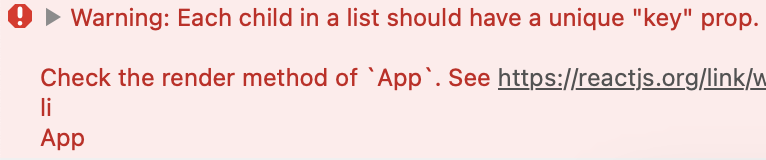

### key란 무엇인가
가령 생성한 dom각각에서 이벤트가 발생했을 때 변화를 감지하여 변화된 부분만 리렌더링을 할 것이다. 이는 key가 존재한다면 더 빠르게 진행되며 리스트의 각각의 자식 노드들은 key를 가져야 한다.

```javascript
function App() {
  const sub = ['수학', '국어', '사회', '과학'];

  return(
    <div>
      {sub.map((e, i) => <li key={i}>{e}</li>)}
    </div>
  )
}
```

key를 index로 지정하는 방식은 쓰이지 않지만 각 요소의 고유번호가 없으므로 인덱스로 지정하였다. 만약 배열의 순서가 바뀌거나 삭제되는 요소가 있다면 효율적으로 렌더링을 할 수 없다.

### 데이터를 추가하거나 삭제하는 기능을 개발해보자


#### 데이터 추가하는 기능 구현
App.js에서 전체 상태를 관리하도록 하였고 names의 getter와 setter를 props로 전달하여 다른 컴포넌트에서 사용하도록 하였다.

```javascript
App.js

import './App.css';
import react, { useState } from 'react';
import MyComponent from './MyComponent';
import Clist from './Clist';
import Cinput from './Cinput';

function App() {
  const [names, setNames] = useState([
    {id: 1, text: '눈사람'},
    {id: 2, text: '얼음'},
    {id: 3, text: '눈'},
    {id: 4, text: '바람'},
    ]);

  return(
    <div>
      <Clist names={names}></Clist>
      <Cinput names={names} setNames={setNames}></Cinput>

      <button onClick={() => {
        console.log(names);
      }}>현재 객체 출력하기</button>
    </div>
  )
}

export default App;
```
Clist는 App.js에서 받은 names를 렌더링하는 컴포넌트이다.
map함수를 사용하여 효율적으로 렌더링 한다.

```javascript
Clist.js

import react, { useState } from 'react';

const Clist = (props) => {
   const {names} = props;

   return(
      names.map((e) => (
         <li key={e.id}>{e.text}</li>
      ))
   ); 
};

export default Clist;
```

Cinput은 App.js에서 받은 setNames를 통해 입력받은 값을 이용하여 names를 수정한다.
수정된 names는 Clist에서 포착되어 추가된 부분만 재랜더링 된다.

```javascript
Cinput.js 

import react, { useState } from 'react';

const Cinput = (props) => {
   const {names, setNames} = props;

   const [inputText, setInputText] = useState('');
   const [nextId, setNextId] = useState(5);   

   const onChange = (e) => {
      setInputText(e.target.value);
   };

   const onClick = () => {
      const nextNames = [
         ...names,
         {id: nextId, text: inputText}
      ];

      setNames(nextNames);

      setNextId((s) => s + 1);
      setInputText('');
   }

   return(
      <div>
         <input type="text" value={inputText} onChange={onChange}></input>
         <button onClick={onClick}>+</button>
      </div>
   ); 
};

export default Cinput;
```
위 출력은 가을과 겨울을 순서대로 입력한 것이다.

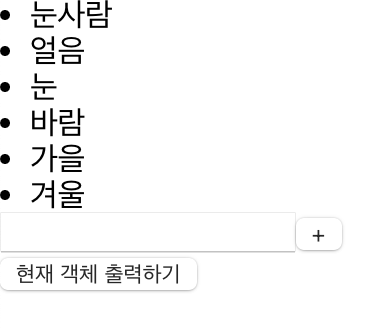

객체의 상태는 console로 출력하도록 하여 확인하였다.

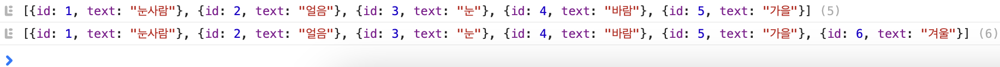

#### 삭제구현하기

map함수를 통해 li요소들을 렌더링 할때 이벤트를 추가하여 더블클릭시 삭제되도록 구현해보겠다.
따라서 Clist에 props로 setNames를 전달해 주어야 한다.
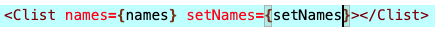

Clist.js

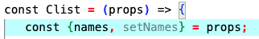

```javascript
import react, { useState } from 'react';

const Clist = (props) => {
   const {names, setNames} = props;

   const onRemove = (id) => {
      const nextNames = names.filter((e) => {
         return e.id !== id
      });

      setNames(nextNames);
   };

   return(
      names.map((e) => (
         <li key={e.id} onDoubleClick={() => {
            onRemove(e.id);
         }}>{e.text}</li>
      ))
   ); 
};

export default Clist;
```
이는 요소를 삭제한 뒤 객체의 상태를 출력한 것이다.


#### 전체 내용

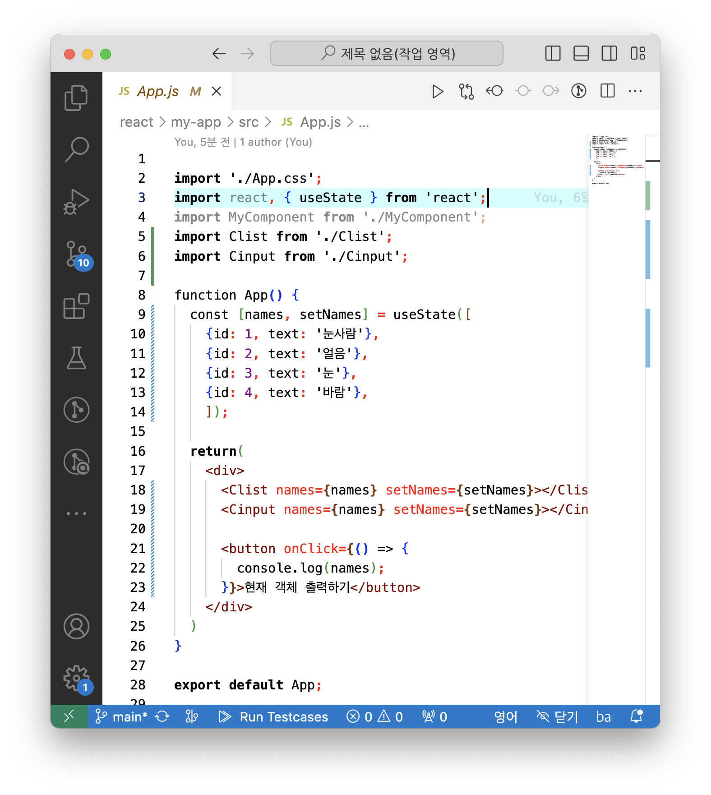

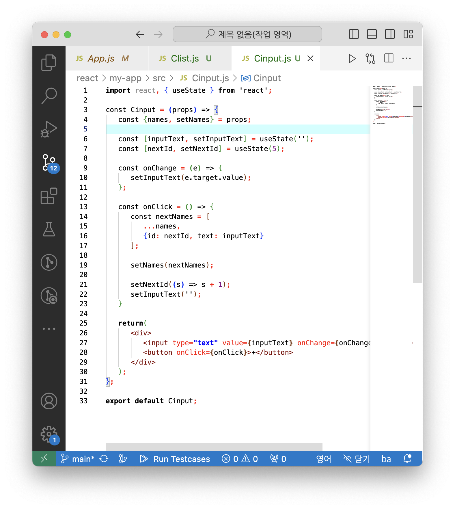

### 7. 컴포넌트의 라이프사이클 메서드

컴포넌트를 처음 렌더링할 때 어떤 작업을 처리해야 하거나 컴포넌트를 업데이트하기 전후로 어떤 작업을 처리해야 할 수도 있고, 또 불필요한 업데이트를 방지해야 할 수도 있다.

컴포넌트의 라이프사이클 메서드는 클래스형 컴포넌트에서만 사용이 가능하다. 함수형 컴포넌트에서는 훅을 이용한다.

### 라이프사이클 메서드는 9종류가 있다.
라이프 사이클은 세가지 카테고리로 나뉜다.

1. 마운트
2. 업데이트
3. 언마운트

### 1. 마운트
DOM이 생성되고 웹 브라우저상에 나타나는 것을 마운트라고 한다.

#### 컴포넌트가 업데이트되는 네가지 경우
1. props가 바뀔 때
2. state가 바뀔 때
3. 부모 컴포넌트가 리렌더링 될 때 (자식 컴포넌트의 props가 바뀌지 않아도 부모 컴포넌트가 리렌더링 되면 자식 컴포넌트 또한 리렌더링 된다.)
4. this.forceUpdate로 강제로 렌더링을 트리거할 때
   
#### 업데이트할 때 호출하는 메서드
1. getDerivedStateFromProps: props의 변화에 따라 state값에도 변화를 주고 싶을 때 사용한다.
2. shouldComponentUpdate: 컴포넌트가 리렌더링을 해야 할지 말아야 할지를 결정하는 메서드이다. true반환시 다음 라이프사이클 메서드를 실행하며 false반환시 작업을 중단한다.
3. render: 컴포넌트를 리렌더링한다.
4. getSnapshotBeforeUpdate: 컴포넌트 변화를 DOM에 반영하기 바로 직전에 호출하는 메서드이다.
5. componentDidUpdate: 컴포넌트의 업데이트 작업이 끝난 후 호출하는 메서드이다.
   
### 2. 언마운트
마운트의 반대과정이다. DOM를 삭제하는 과정이다.

#### 언마운트할 때 호출하는 메서드
- componentWillUnmount: 컴포넌트가 웹브라우저상에서 사라지기 전에 호출하는 메서드이다.

함수형 컴포넌트에서 라이프사이클 메서드를 훅을 통해 사용하는 예시는 뒤에 나온다.

### 8. Hooks

- useState
  - useState는 가장 기본적인 Hook이며 가변적인 상태를 지닐 수 있게 해준다.

```javascript
function App() {
  const [value, setValue] = useState(0);

  return(
    <div>
      <p1>현재 카운터 값은 {value}</p1>
      <div>
        <button onClick={() => {
          setValue(value + 1);
        }}>+1</button>

        <button onClick={() => {
          setValue(value - 1);
        }}>-1</button>
      </div>
    </div>
  )
}
```

  - 여러 State사용도 가능하다
  
```javascript

import './App.css';
import react, { useState } from 'react';

function App() {
  const [name, setName] = useState('');
  const [age, setAge] = useState('');

  const onChangeName = (e) => {
    setName(e.target.value);
  }

  const onChangeAge = (e) => {
    setAge(e.target.value);
  }

  return(
    <div>
      <div>
        <input type="text" value={name} onChange={onChangeName}></input>
        <input type="text" value={age} onChange={onChangeAge}></input>
      </div>

      <div>
        <h2>{name}</h2>
        <h2>{age}</h2>
      </div>
    </div>
  )
}

export default App;

```
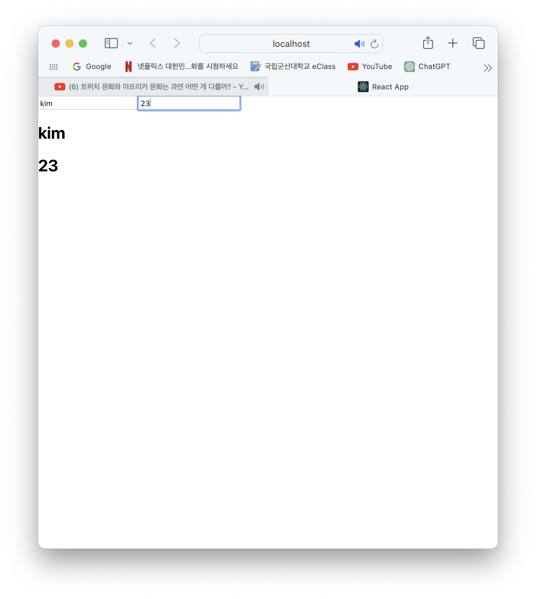

- useEffect는 리액트 컴포넌트가 렌더링될 때마다 특정 작업을 수행하도록 설정할 수 있는 Hook이다.

```javascript

import './App.css';
import react, { useEffect, useState } from 'react';

function App() {
  const [name, setName] = useState('');
  const [age, setAge] = useState('');

  const onChangeName = (e) => {
    setName(e.target.value);
  }

  const onChangeAge = (e) => {
    setAge(e.target.value);
  }

  useEffect(() => {
    console.log('렌더링이 완료되었습니다.');
    console.log({
      name,
      age
    })
  });

  return(
    <div>
      <div>
        <input type="text" value={name} onChange={onChangeName}></input>
        <input type="text" value={age} onChange={onChangeAge}></input>
      </div>

      <div>
        <h2>{name}</h2>
        <h2>{age}</h2>
      </div>
    </div>
  )
}

export default App;

```

마운트될 때만 실행하고 싶을 때 두 번째 파라미터로 비어있는 배열을 넣어 주면 된다. (화면에 처음 렌더링 될때만 실행된다.)

```javascript
useEffect(() => {
    console.log('마운트될 때만 실행됩니다.');
  }, []);
```

특정 값이 업데이트 될때만 실행하고 싶을 때 두 번째 파라미터로 배열에 deps를 넣어준다

```javascript
useEffect(() => {
    console.log(name);
  }, [name]);

  useEffect(() => {
    console.log(age);
  }, [age]);
```

언마운트 될때 실행할 함수(뒷정리함수라고도 함)
```javascript
useEffect(() => {
    console.log(age);

    return () => {
      console.log('clean up');
    }
  }, [age]);
```

하지만 언마운트 될때 뿐만 아니라 값이 업데이트 될때 업데이트 되기 직전에도 뒷정리함수가 호출된다. 오직 언마운트 될때만 뒷정리 함수가 호출되게 하기 위해선 deps를 빈배열로 전달해주면 된다.

```javascript
useEffect(() => {
  console.log(age);

  return () => {
    console.log('clean up');
  }
}, []);
```

### useReducer로 더 다양한 상황에 따라 다양한 상태를 업데이트하기

리듀서는 현재 상태, 그리고 업데이트를 위해 필요한 정보를 담은 액션값을 전달받아 새로운 상태를 반환하는 함수이다.

#### 리듀서를 이용해서 카운터를 구현해보자

```javascript

import './App.css';
import react, { useEffect, useReducer, useState } from 'react';

function reducer(state, action) { ///state와 action을 전달 받음
  ///action은 사용자가 dispatch로 전달함
  switch(action.type) {
    case 'INCREMENT':
      return {
        value: state.value + 1
      };

    case 'DECREMENT':
      return {
        value: state.value - 1
      };

    default:
      return state;
  }
}

const Counter = () => {
  const [state, dispatch] = useReducer(reducer, {
    value : 0
  });

  return (
    <div>
      <p>current state of value : {state.value}</p>

      <div>
        <button onClick={() => {
          dispatch({type : 'INCREMENT'});
        }}> + </button>

        <button onClick={() => {
          dispatch({type : 'DECREMENT'});
        }}> - </button>
      </div>
    </div>
  )
}

function App() {
  


  return(
    <div>
      <Counter></Counter>
    </div>
  )
}

export default App;
```

reducer라는 함수는 state(현재상태)와 action(사용자의 액션)을 전달 받는다. action은 사용자가 전달한 객체를 의미하며 그 객체에 타입을 넣어줘서 타입에 따른 상태를 업데이트한다. type이 아니여도 된다. 사용자는 dispatch에 객체를 전달해주어 reducer를 작동시킨다. 
```javascript
function reducer(state, action) { 
  switch(action.type) {
    case 'INCREMENT':
      return {
        value: state.value + 1
      };

    case 'DECREMENT':
      return {
        value: state.value - 1
      };

    default:
      return state;
  }
}
```

useReducer에는 custom reducer함수를 전달해주며 두번째 전달인자로 초기 객체정보를 전달해준다.
```javascript
const [state, dispatch] = useReducer(reducer, {
    value : 0
  });
```

### useReducer의 장점
컴포넌트업데이트 로직을 컴포넌트 바깥으로 빼낼 수 있다.


### react input tag 출력해보기
```javascript

import './App.css';
import react, { useEffect, useReducer, useState } from 'react';
import CustomInput from './CustomInput';


function App() {

  const onChange = (e) => {
    console.log(Object.getOwnPropertyDescriptors(e.target));
  }

  return(
    <div>
      <input name='test' onChange={onChange}></input>
      {/* <CustomInput></CustomInput> */}
    </div>
  )
}

export default App;
```

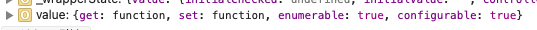

value필드는 input의 프로퍼티에 있지만 name은 보이지 않는다.

#### name필드가 없는 것에 대한 gpt의 해답
React에서 이벤트 핸들러에 전달되는 SyntheticEvent 객체는 원래의 DOM 이벤트를 감싼 객체로, 일부 DOM 이벤트의 속성을 포함하고 있습니다. 그러나 이 객체에는 name 속성이 직접적으로 존재하지 않습니다. 대신, React에서는 name 속성이 아니라 event.target.name의 형태로 사용되는 것이 일반적입니다.

### reducer를 이용하여 input상태 관리하기
```javascript
import { useReducer, useState } from "react";

function reducer(state, action) {
   return {
      ...state,
      [action.name] : action.value
   };
} ///action에 name과 value를 받으며 state내부에 name프로퍼티 해당하는 value를 업데이트한다

const CustomInput = () => {

  const [state, dispatch] = useReducer(reducer, {
    name : '',
    age: ''
  });

  const {name, age} = state; ///destructuring
  
  const onChange = (e) => {
    dispatch(e.target);
    ///input tag에서의 e.target은 input tag를 가리키며 이는 name field와 age field를 갖고있음
  }
      
  return (
      <div>
        <div>
            <input name="name" value={name} onChange={onChange}></input>
            <input name="age" value={age} onChange={onChange}></input>
        </div>

        <div>
            <h2>이름 : {name}</h2>
            <h2>나이 : {age}</h2>
        </div>
      </div>
  )
}

export default CustomInput;
```

#### 리듀서 함수 작성하기
action은 input자체를 전달 할 것이고 그 객체안에 name field와 value field를 이용하여 state를 업데이트 할 것이다.

```javascript
function reducer(state, action) {
   return {
      ...state,
      [action.name] : action.value
   };
}
```

#### 초기상태 작성
```javascript
const [state, dispatch] = useReducer(reducer, {
      name : '',
      age: ''
   });
```

#### onChange 함수 작성 및 리턴 작성

onChange함수에서는 e.target자체를 dispatch로 전달해준다.

```javascript
const onChange = (e) => {
      dispatch(e.target);
      ///input tag에서의 e.target은 input tag를 가리키며 이는 name field와 age field를 갖고있음
   }
   
   return (
      <div>
         <div>
            <input name="name" value={name} onChange={onChange}></input>
            <input name="age" value={age} onChange={onChange}></input>
         </div>

         <div>
            <h2>이름 : {name}</h2>
            <h2>나이 : {age}</h2>
         </div>
      </div>
   )
```

### 전체적인 과정 정리

1. 사용자가 이벤트를 발생시킬 때 dispatch를 통해 action을 전달함
2. reducer에서 action과 현재 상태인 state를 통해서 state를 업데이트함

사용자는 리듀서 함수를 작성하여 useReducer에 전달해줘야 하면 두번째 전달인자로 초기상태를 전달해준다. 이때 받은 state와 dispatch를 통해 reducer함수 작성 및 이벤트 핸들러 작성을 해야한다.


출처: https://velog.io/@line_jeong32/React-상태-관리


### useMemo를 통한 최적화 진행하기

간단한 평균계산기를 만들어보자
```javascript

import './App.css';
import react, { useEffect, useReducer, useState } from 'react';

const getAverage = (numbers) => {
  console.log('평균값 계산 중..');
  if(numbers.length === 0) {
    return 0;
  }
  const sum = numbers.reduce((a, b) => a + b);
  return sum / numbers.length;
};

const Average = () => {
  const [list, setList] = useState([]);
  const [number, setNumber] = useState('');

  const onChange = (e) => {
    setNumber(e.target.value);
  };

  const onInsert = (e) => {
    const nextList = [
      ...list, parseInt(number)
    ];
    setList(nextList);
    setNumber('');
  }

  return (
    <div>
      <div>avg : {getAverage(list)}</div>
      <input value={number} onChange={onChange}></input>

      <button onClick={onInsert}>add</button>
    </div>
  )
}

function App() {

  return(
    <div>
      <Average></Average>
    </div>
  )
}

export default App;
```

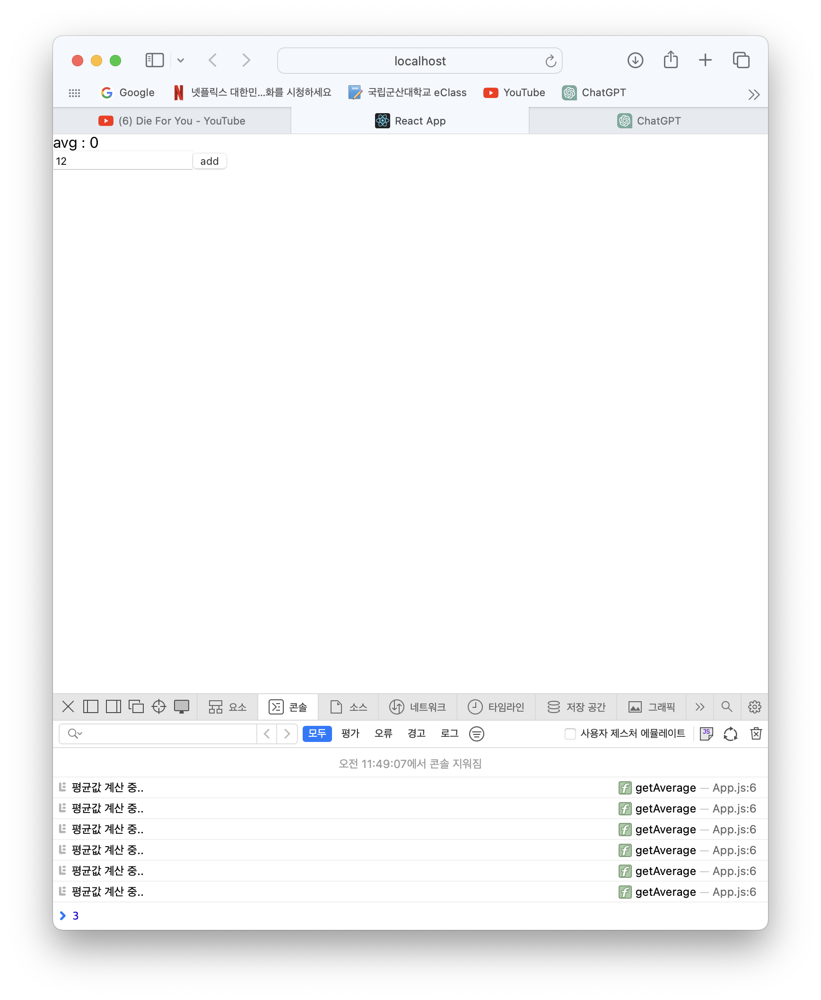

getAverage함수가 호출 될 때 마다 평균값 계산중이라는 문자열을 출력하게 했다
출력 결과를 보면 list가 수정 될때 뿐만 아니라 input이 수정될때도 getAverage함수가 호출 되는 것을 확인 할 수 있다. useMemo를 사용하면 렌더링 하는 과정에서 특정값이 바뀌었을 때만 연산을 실행하게 할 수 있다. 여기 예시에서는 list가 바뀌었을 때만 연산을 진행하게 할 수 있다.

```javascript
  const avg = useMemo(() => {
    return getAverage(list)
  }, [list]);

```

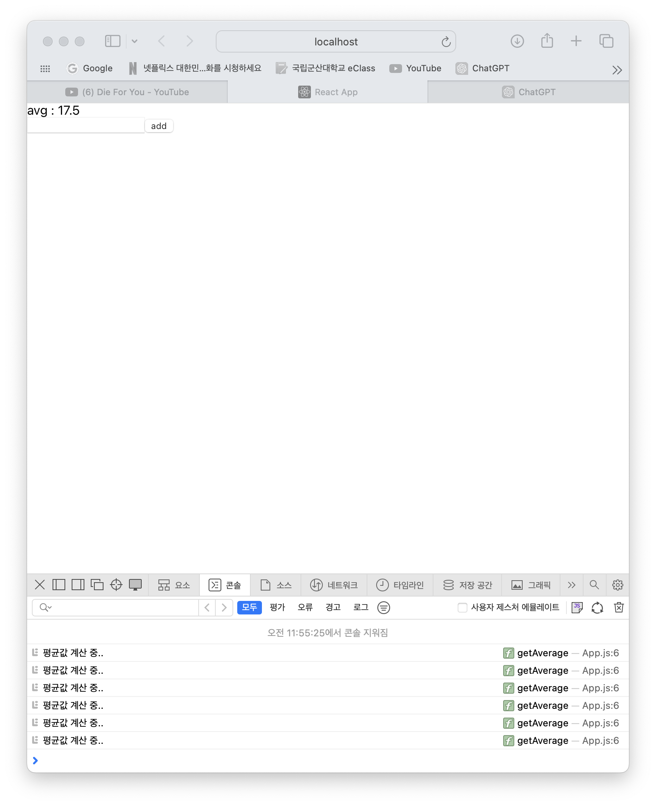

#### useCallback함수를 이용한 최적화

컴포넌트가 렌더링될 때 함수들도 재생성된다. onChange함수같은 경우에는 렌더링 될때마다 새로운 함수를 사용할 필요가 없다. 따라서 useCallback함수의 두번째 전달인자로 빈 배열을 전달하여 처음 렌더링 될때만 생성하고 그 이후에 새로운 함수를 생성하지 않게 할 수 있다.

```javascript
const onChange = useCallback((e) => {
    setNumber(e.target.value);
  }, []);
```

마찬가지로 onInsert함수는 list와 number를 사용하며 list와 number가 바뀌지 않는다면 새로운 함수를 생성할 필요가 없으므로 최적화를 진행한다 이때 deps에는 list와 number를 전달해준다.

```javascript
const onInsert = useCallback(() => {
    const nextList = [
      ...list, parseInt(number)
    ];
    setList(nextList);
    setNumber('');
  }, [list, number]);
```

주의할 점은 useCallback함수의 두번째 전달인자로 어떤 값이 바뀌었을 때 함수를 새로 생성해야 하는지 명시해야 한다.

### useRef를 통해서 포커스 이동하기

#### useRef의 명세

useRef returns a mutable ref object whose .current property is initialized to the passed argument (initialValue). The returned object will persist for the full lifetime of the component.

#### 사용명세
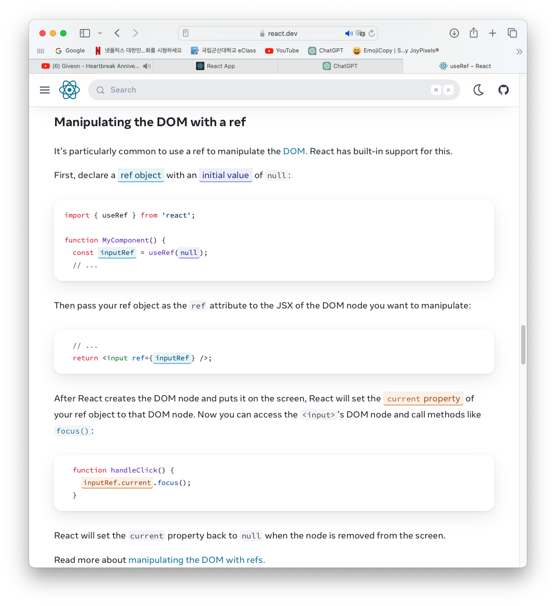

#### useRef 사용명세 정리

1. ref를 통해 DOM을 다룰 때 초기 값을 null로 하여 inputRef객체를 생성한다.
2. DOM element의 ref attribute에 inputRef객체를 전달한다.
3. inputRef.current를 통해서 element에 접근한다.

```javascript
const inputEl = useRef(null);

...

const onInsert = useCallback(() => {
    const nextList = [
      ...list, parseInt(number)
    ];
    setList(nextList);
    setNumber('');
    inputEl.current.focus();
  }, [list, number]);
```

#### useRef를 사용하여 로컬 변수 사용하기
useRef를 통해서 로컬변수를 변경할 수 있다. 이때 변경되어도 컴포넌트가 리렌더링 되지 않는 것을 유의해야 한다. 즉 렌더링과 관련없는 변수를 관리할 때 사용할 수 있다.

```javascript

import './App.css';
import react, { useCallback, useEffect, useMemo, useReducer, useRef, useState } from 'react';

const RefSample = () => {
  const id = useRef(1);
  const setId = (n) => {
    id.current = n;
  }

  const printId = () => {
    console.log(id.current);
  }

  const [value, setValue] = useState('');

  const onChange = useCallback((e) => {
    setValue(e.target.value);
  }, []);
  
  const onClick = () => {
    setId(value);
  }

  return (
    <div>
      {id.current}
      
      <input onChange={onChange}></input>
      <button onClick={onClick}>edit</button>
      <button onClick={() => {
        console.log(id.current);
      }}>print id</button>
    </div>
  )
}

function App() {
  
  return(
    <div>
      <RefSample></RefSample>
    </div>
  )
}

export default App;
```
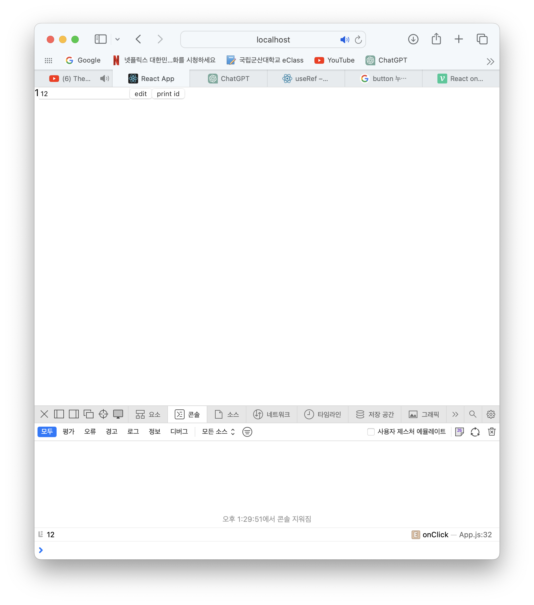

위 출력을 보면 12로 수정해도 리렌더링을 하지 않는 것을 확인할 수 있다. 또한 출력하는 버튼을 눌렀을 때 수정된 id.current값을 얻을 수 있는 것도 확인할 수 있다. 따라서 리렌더링할 필요없는 로컬변수를 다룰 때 useRef를사용할 수 있다.

### custom Hook으로 input상태 관리하기

```javascript
import React, { useReducer } from "react";

function reducer(state, action) {
   return {
      ...state,
      [action.name] : action.value
   };
}

export default function useInput(initialForm) {
   const [state, dispatch] = useReducer(reducer, initialForm);

   const onChange = e => {
      dispatch(e.target);
   };

   return [state, onChange];
}
```

useInput함수는 전달받은 초기객체와 리듀서 함수를 통해서 state와 dispatch를 생성하고 onChange함수에서 dispatch를 통해서 이벤트 정보를 전달한다. App에서 사용하는 useInput함수는 현재상태와 이벤트시 호출할 콜백함수만 받으면 되므로 custom hook을 만들어 필요한 상태와 콜백함수만 사용할 수 있도록 하며 컴포넌트 바깥에서 상태를 관리하는 로직을 구현할 수 있다.

```javascript

import './App.css';
import react, { useCallback, useEffect, useMemo, useReducer, useRef, useState } from 'react';
import useInput from './useInput';

function App() {
  const [state, onChange] = useInput({
    name: '',
    age: '',
  });

  const {name, age} = state;

  return(
    <div>
      <input name='name' value={name} onChange={onChange}></input>
      <input name='age' value={age} onChange={onChange}></input>

      <div>
        <h2>{name}</h2>
        <h2>{age}</h2>
      </div>
    </div>
  )
}

export default App;
```

App에서는 state와 onChange만을 사용하여 상태관리를 할 수 있다.

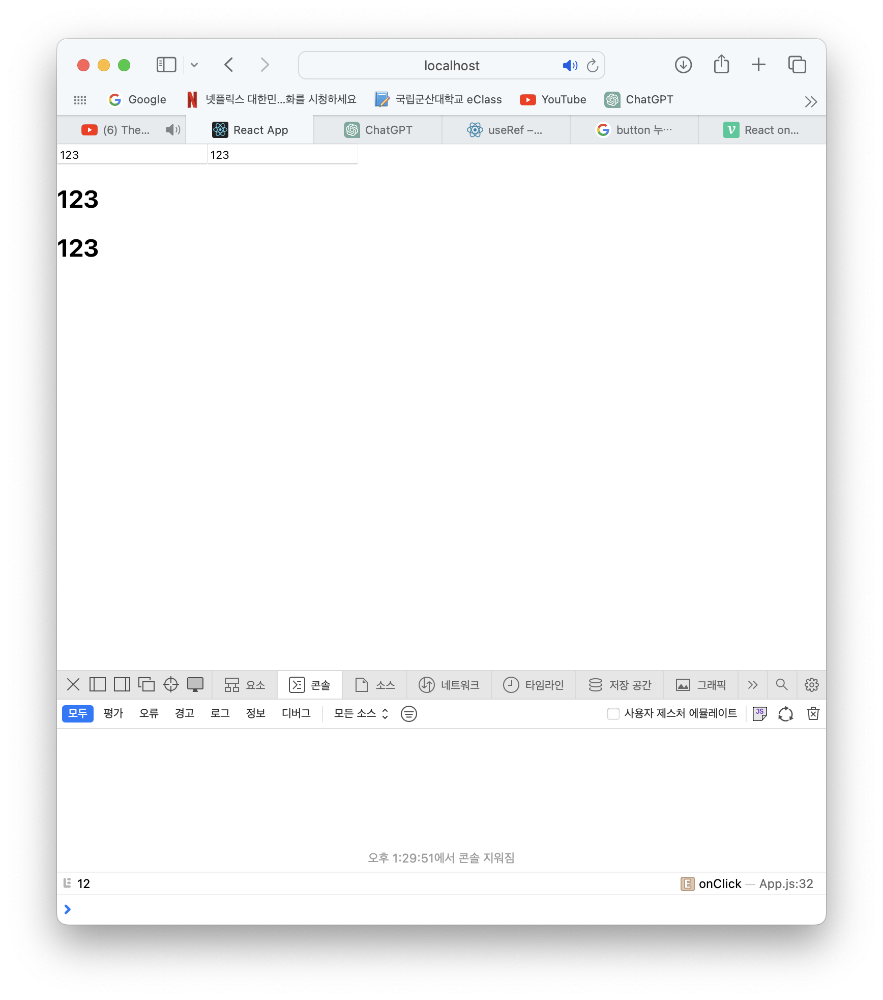

### custom hook을 이용하여 counter구현하기

마찬가지로 useCounter는 상태와 콜백함수만 반환하여 App에서 state와 onClick만 받아 사용하게 했다.

```javascript
import React, { useReducer } from "react";

function reducer(state, action) {
   if(action.name === 'INCREMENT') {
      return {
         ...state,
         count: state.count + 1
      };
   } else if(action.name === 'DECREMENT') {
      return {
         ...state,
         count: state.count - 1
      };
   }
}

export default function useCounter(initialForm) {
   const [state, dispatch] = useReducer(reducer, initialForm);

   const onClick = (e) => {
      dispatch(e.target);
   }

   return [state, onClick];
}
```

```javascript

import './App.css';
import react, { useCallback, useEffect, useMemo, useReducer, useRef, useState } from 'react';
import useInput from './useInput';
import useCounter from './useCounter';

function App() {
  const [state, onClick] = useCounter({
    count : 0
  });


  return(
    <div>
      <h2>{state.count}</h2>
      <button name='INCREMENT' onClick={onClick}>+</button>
      <button name='DECREMENT' onClick={onClick}>-</button>
    </div>
  )
}

export default App;

```

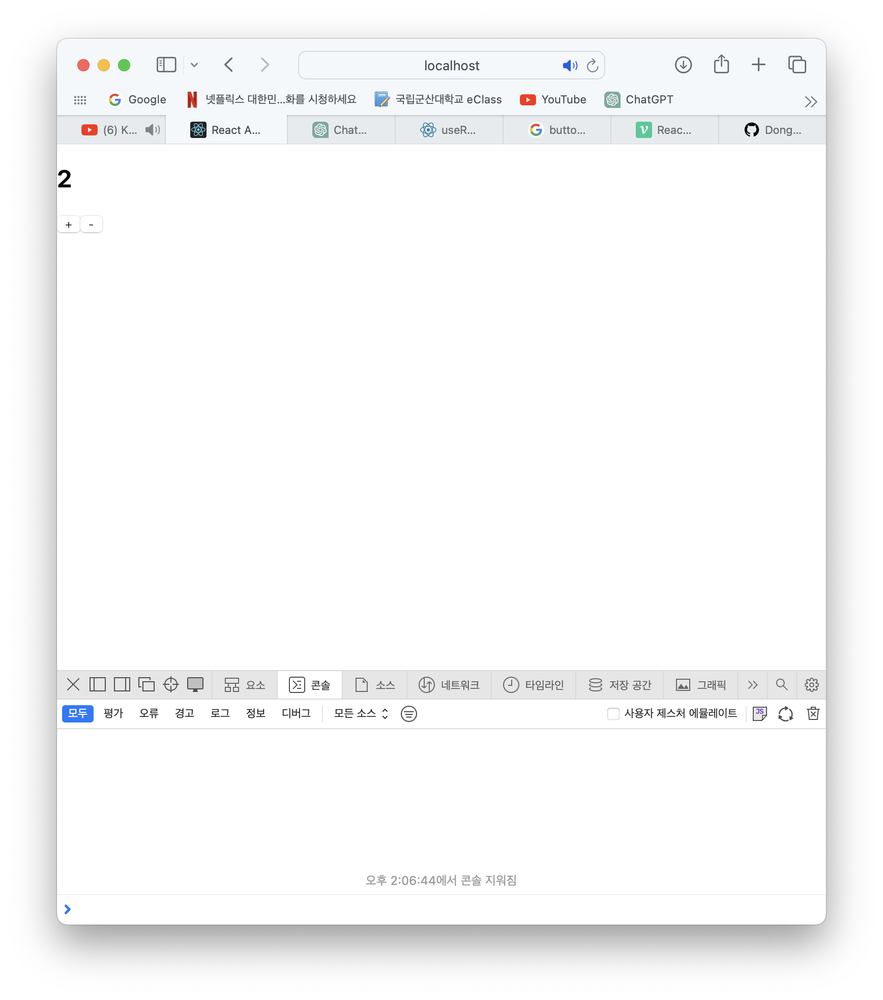

상태관리 코드를 분리하여 컴포넌트구현에 집중할 수 있을 듯 하다

### 9. component styling
리액트에서 컴포넌트를 스타일링 하는 방식은 크게 4가지로 볼 수 있다.

1. general CSS
2. Sass
3. CSS module
4. styled-component

general CSS는 기본적인 방식이므로 생략하며 Sass는 충돌이 잦아 생략한다.

### styled-component

스타일드컴포넌트는 자바스크립트 파일안에서 스타일을 선언하는 방식이다.


설치
```
npm install styled-components
```

```javascript

import './App.css';
import react, { useCallback, useEffect, useMemo, useReducer, useRef, useState } from 'react';
import useInput from './useInput';
import useCounter from './useCounter';
import styled, { css } from 'styled-components';

const Box = styled.div`
  background: ${props => props.color || 'blue'};
  padding: 1rem;
  display: flex;
`;

const Button = styled.button`
  background: white;
  color: black;
  border-radius: 4px;
  padding: 0.5rem;
  display: flex;
  align-items: center;;
  justify-content: center;;
  box-sizing: border-box;
  font-size: 1rem;
  font-weight: 600;

  &:hover { /// &문자를 사용하여 자기 자신 선택
    background: rgba(255, 255, 255, 0.9);
  }

  ${
    props => props.inverted && css`
      background: none;
      border: 2px solid white;
      color: white;

      &:hover {
        background: white;
        color: black;
      }
    `
  };

  & + button {
    margin-left: 1rem;
  }
`;


function App() {
  

  return(
    <div>
      <Box color='black'>
        <Button>Hi</Button>
        <Button inverted={true}>outline</Button>
      </Box>
    </div>
  )
}

export default App;

```
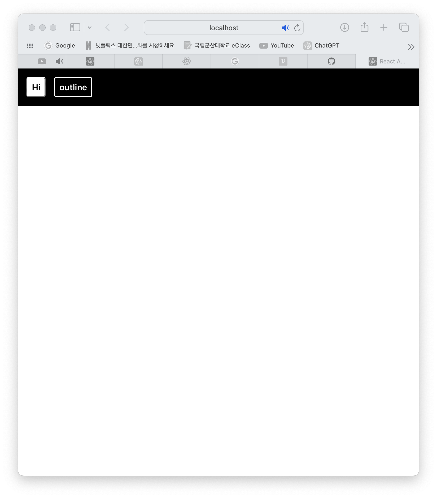

styled-component에서는 props로 전달한 값들을 디자인할 때 사용할 수 있다는 것이다.

```javascript
const Box = styled.div`
  background: ${props => props.color || 'blue'};
  padding: 1rem;
  display: flex;
`;
...
<Box color='black'>
        <Button>Hi</Button>
        <Button inverted={true}>outline</Button>
      </Box>
```

**Box컴포넌트를 사용할 때 props로 받은 color값을 이용하여 background값을 지정할 수 있다.**

```javascript
&:hover { /// &문자를 사용하여 자기 자신 선택
    background: rgba(255, 255, 255, 0.9);
  }
```

버튼컴포넌트를 보면 자기자신을 선택할 수 있는 &를 이용하여 hover시에 background를 변경한다.

```javascript
${
    props => props.inverted && css`
      background: none;
      border: 2px solid white;
      color: white;

      &:hover {
        background: white;
        color: black;
      }
    `
  };
```

또한 props로 전달받은 inverted값이 true인경우에 대해서 다른 스타일을 적용한다. 이때 css``를 통해서 새로운 스타일들을 적용한다. 이는 tagged template literal이며, 이를 사용하지 않으면 그냥 문자열로 인식한다.

사용해야할 태그명이 유동적이거나 특정 컴포넌트 자체에 스타일링해 주고 싶다면 styled(component)형태로 구현이 가능하다

```javascript

import './App.css';
import react, { useCallback, useEffect, useMemo, useReducer, useRef, useState } from 'react';
import useInput from './useInput';
import useCounter from './useCounter';
import styled, { css } from 'styled-components';

const Box = styled.div`
  background: ${props => props.color || 'blue'};
  padding: 1rem;
  display: flex;
`;

const Button = styled.button`
  background: white;
  color: black;
  border-radius: 4px;
  padding: 0.5rem;
  display: flex;
  align-items: center;;
  justify-content: center;;
  box-sizing: border-box;
  font-size: 1rem;
  font-weight: 600;

  &:hover { /// &문자를 사용하여 자기 자신 선택
    background: rgba(255, 255, 255, 0.9);
  }

  ${
    props => props.inverted && css`
      background: none;
      border: 2px solid white;
      color: white;

      &:hover {
        background: white;
        color: black;
      }
    `
  };

  & + button {
    margin-left: 1rem;
  }
`;

const CustomComponent = ({className}) => {
  return(
    <h2 className={className}>hello</h2>
  );
};

const StyledCustomComponent = styled(CustomComponent)`
  font-size: 2rem;
`

function App() {
  

  return(
    <div>
      {/* <Box color='black'>
        <Button>Hi</Button>
        <Button inverted={true}>outline</Button>
      </Box> */}

      <StyledCustomComponent></StyledCustomComponent>
    </div>
  )
}

export default App;
```

위 예시에서 className을 받아서 전달해주기만 하면 styled에 다양한 컴포넌트를 전달할 수 있다.

### 반응형 디자인
브라우저의 가로 크기에 따라서 다른 스타일을 적용하기 위해서 media쿼리를 사용한다.

```javascript
const Box = styled.div`
  background: ${props => props.color || 'blue'};
  padding: 1rem;
  display: flex;

  width: 1024px;
  margin: 0 auto;
  @media (max-width: 1024px) {
    width: 768px;
  }

  @media (max-width: 768px) {
    width: 100%;
  }
`;
```

1024이상
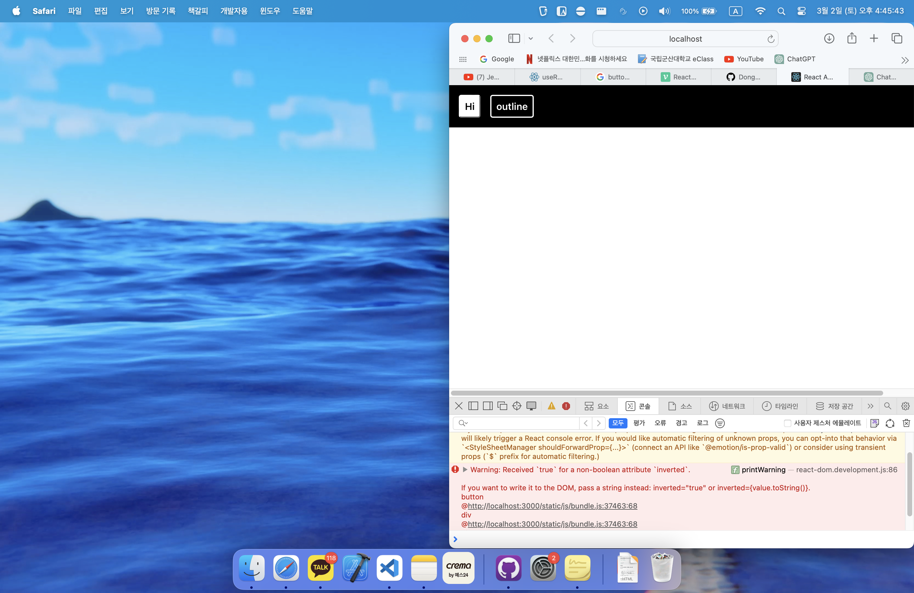

768미만
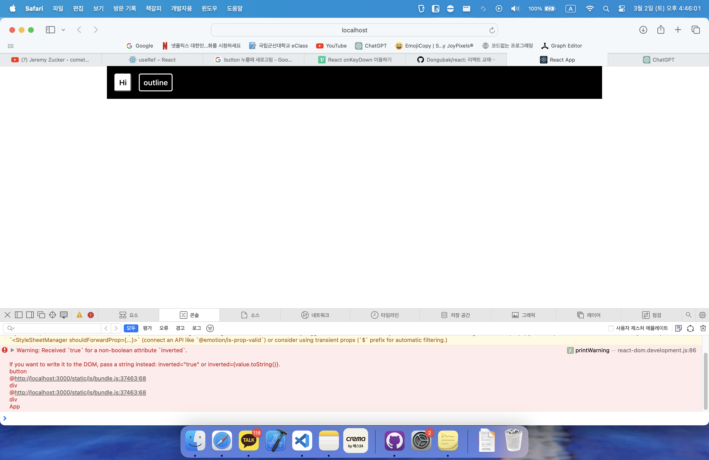

### 13. react router

라우팅이란 웹애플리케이션에서 라우팅이라는 개념은 사용자가 요청한 URL에 따라 알맞은 페이지를 보여주는 것을 의미한다.

웹애플리케이션을 만들 때 하나의 페이 혹은 여러 페이지로 구성할 수 있다.

즉 여러 페이지로 구성된 웹 애플리케이션을 만들 때 페이지 별로 켐포넌트들을 분리해가면서 프로젝트를 관리하기 위해 필요한 것이 라우팅 시스템이다.

react router : 컴포넌트 기반으로 라우팅 시스템을 설정할 수 있으며 리액트 관련 라이브러리 중에서 가장 오래됨
Next.js : 리액트 라우터의 대안으로 많이 사용되고 있으며 파일 경로 기반으로 작동한다.


#### SPA(single page application)이란
SPA란 하나의 페이지로 이루어진 애플리케이션이라는 의미이다.

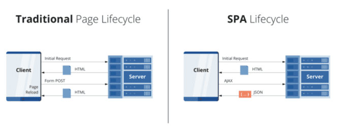

싱글페이지 애플리케이션 이전에는 멀티페이지 애플리케이션이 있었다. 이는 사용자가 다른 페이지로 이동할 때마다 새로운 html을 서버로부터 받아오며 CSS, JS등 리소스를 전달받아 화면에 보여줬다. 사용자와 인터렉션이 많이 없는 경우에 적합한 방법이지만 새로운 페이지를 보여줄 때마다 서버에서 받아와야 하므로 서버자원을 많이 사용하며 트래픽도 많이 나온다고 한다.

이에반해 싱글페이지 애플리케이션은 시작할 때 한번 html을 서버에서 받고 이후에 화면을 업데이트할 때엔 서버에서 필요한 데이터만 받아서 렌더링한다.

#### 기본적인 라우팅 구현해보기
```javascript
npm install react-router-dom
```

react-router-dom을 설치한 후 home component를 생성해보자

```javascript
import React from "react";
import { Link } from "react-router-dom";

const Home = () => {
   return (
      <div>
         <h1>
            홈
         </h1>

         <p>가장 먼저 보여지는 페이지</p>
         <Link to="/about">소개</Link>
      </div>
   )
}

export default Home;
```

이 컴포넌트는 처음에 보여지는 페이지이며 App.js에서 Routes안에 Route의 / 즉 index경로에 보여지는 컴포넌트이다.

```javascript
import React from "react";
import { Route, Routes } from "react-router-dom";
import Home from "./pages/Home";
import About from "./pages/About";

const App = () => {
  return (
    <Routes>
      <Route path="/" element={<Home></Home>}></Route>
    </Routes>
  )
}

export default App;
```

이제 index.js에서 라우터를 적용해주어야 하는데 BrowserRouter에 App을 감싸주면 된다.

```javascript
import React from 'react';
import ReactDOM from 'react-dom/client';
import './index.css';
import App from './App';
import reportWebVitals from './reportWebVitals';
import { BrowserRouter } from 'react-router-dom';


const root = ReactDOM.createRoot(document.getElementById('root'));
root.render(
  <BrowserRouter>
    <App />
  </BrowserRouter>
);

// If you want to start measuring performance in your app, pass a function
// to log results (for example: reportWebVitals(console.log))
// or send to an analytics endpoint. Learn more: https://bit.ly/CRA-vitals
reportWebVitals();
```

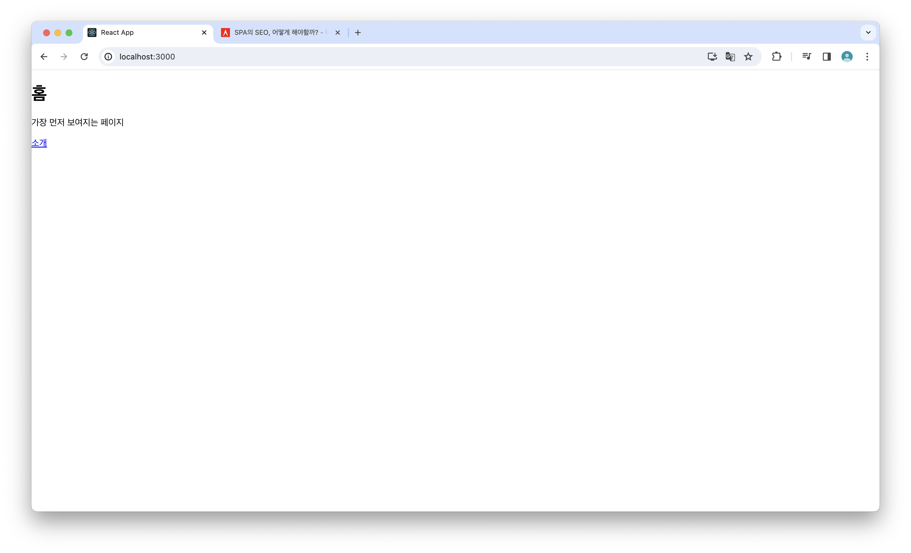


이제 /about으로 이동시에 라우팅할 컴포넌트를 만든다.

```javascript
import React from "react";

const About = () => {

   return (
      <div>
         <h2>소개</h2>
         <p>리액트 라우터를 사용해 보는 프로젝트입니다.</p>
      </div>
   )
}

export default About;
```

App.js에서 라우팅 경로를 추가해주면 주소창에 /about을 치면 About 컴포넌트로 이동한다.
```javascript
<Routes>
  <Route path="/" element={<Home></Home>}></Route>
  <Route path="/about" element={<About></About>}></Route>
</Routes>
```

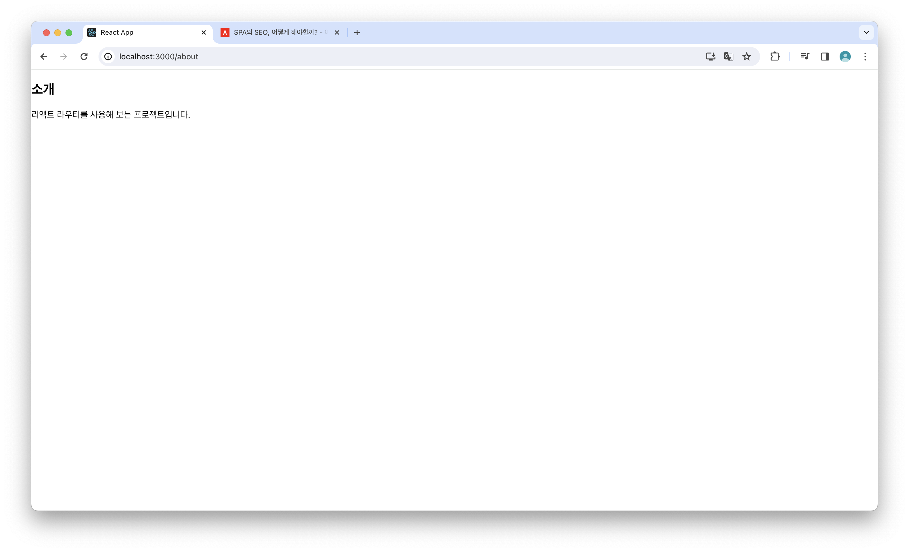


#### 라우트(<Route>) 컴포넌트 사용법
```javascript
<Route path='주소' element={<CustomComponent>} />
```

#### 링크(<Link>) 컴포넌트 사용법
보통 다른 페이지로 이동할 경우 a태그를 사용하지만 브라우저에서 a태그를 누르면 새로운 페이지를 불러와 싱글페이지 애플리케이션을 만들 수 없다. 그래서 Link컴포넌트를 사용하여 라우팅을 한다.

```javascript
<Link to='경로'>링크 이름</Link>
```

위에서 about페이지로 이동할 때 사용한 예시는 다음과 같다.
```javascript
<Link to="/about">소개</Link>
```

#### URL 파라미터와 쿼리스트링

URL파라미터의 예시 : /profile/velopert
쿼리스트링의 예시 : /articles?page=1&keyword=react

파라미터는 경로에 유동적인 값을 넣는 형태이며 쿼리스트링은 ?이후에 키워드를 전달할 때 사용한다.


#### URL파라미터 사용하기

URL이 /profiles/사용자이름 일때
사용자이름을 username으로 받아서 해당하는 값들을 렌더링한다.

<Route path="/profiles/:username" component={<Profile></Profile>}></Route>

/profiles/:username은 URL 파라미터를 받는다는 것이며 뒤에 붙는 문자열을 username으로 받는 다는 것이다. Profile컴포넌트에서 useParams를 통해 파라미터 정보를 얻고 username프로퍼티 값으로 뒤에 문자열을 얻는다 다음은 예시이다.

App.js

```javascript
import React from "react";
import { Route, Routes } from "react-router-dom";
import Home from "./pages/Home";
import About from "./pages/About";
import Profile from "./pages/Profile";

const App = () => {
  return (
    <Routes>
      <Route path="/" element={<Home></Home>}></Route>
      <Route path="/about" element={<About></About>}></Route>
      <Route path="/profiles/:username" element={<Profile></Profile>} />
    </Routes>
  )
}

export default App;
```

Profile.js

```javascript
import React from "react";
import { useParams } from 'react-router-dom';


const data = {
   velopert: {
      name: '김민준',
      description: '리액트를 좋아하는 개발자',
   },
   gildong : {
      name: '홍길동',
      description: '고전 소설 홍길동전의 주인공',
   },
};

const Profile = () => {
   const params = useParams();
   const profile = data[params.username];

   return (
      <div>
         <h1>사용자 프로필</h1>
         {
            profile ? (
               <div>
                  <h2>{profile.name}</h2>
                  <p>{profile.description}</p>
               </div>
            ) : (<p>
               존재하지 않는 프로필입니다.
            </p>)
         }
      </div>
   )
};

export default Profile;
```

다음과 같은 과정으로 URL 파라미터를 얻었다.

```javascript
const params = useParams();
const profile = data[params.username];
```

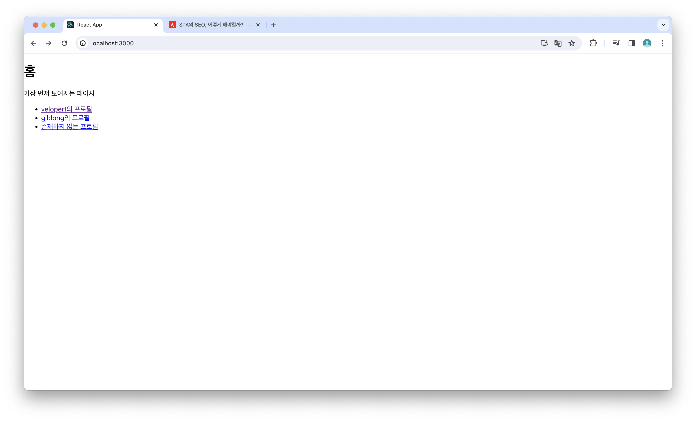

#### 쿼리스트링 사용하기

쿼리스트링은 useSearchParams를 통해 사용할 수 있다. getter와 setter가 있다.

```javascript
const [searchParams, setSearchParams] = useSearchParams();
```

쿼리 값을 get함수를 통해 얻을 수 있다.

```javascript
const [searchParams, setSearchParams] = useSearchParams();
const detail = searchParams.get('detail');
```

또한 이벤트 발생시에 쿼리값을 수정할 수도 있다.

```javascript
const onToggleDetail = () => {
  setSearchParams({
    detail: detail === 'true' ? false : true
  })
}
```

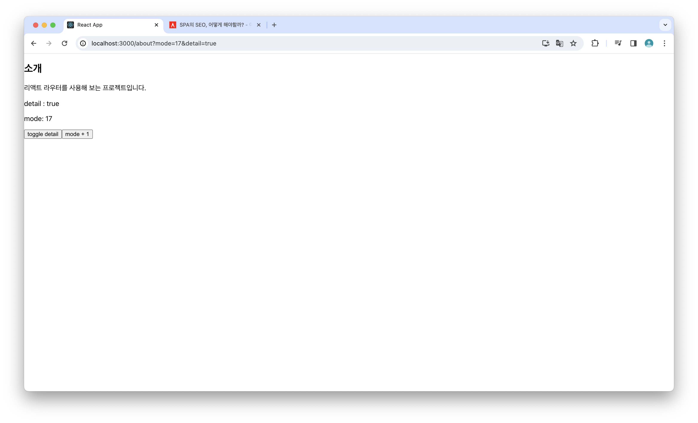


#### 중첩된 라우트

/articles/1, articles/2 등등 여러 게시물을 들어갈 수 있어야한다.

```javascript
<Route path="/articles/:id" element={<Articles />} />
```
또는

```javascript
<Route path="/articles" element={<Articles />}>
  <Route path=":id" element={<Article />} />
</Route>
```
이렇게 가능하다 하지만 중첩된 라우팅의 경우 Outlet컴포넌트를 통해서 Article 컴포넌트를 Articles컴포넌트에서 조회가 가능하다. 따라서 Articles 컴포넌트에는 <Outlet>컴포넌트를 사용해야 한다.

한편 게시글로 이동하는 Link는 다음과 같을 것이다.

```javascript
<Link to="/articles/1" element={<Article />} />
```

Article component에서는 useParams를 통해서 1이라는 값을 얻을 수 있을 것이다.

따라서 코드들은 다음과 같다.

```javascript
App.js

import React from "react";
import { Route, Routes } from "react-router-dom";
import Home from "./pages/Home";
import About from "./pages/About";
import Profile from "./pages/Profile";
import Articles from "./pages/Articles";
import Article from "./pages/Article";

const App = () => {
  return (
    <Routes>
      <Route path="/" element={<Home></Home>}></Route>
      <Route path="/about" element={<About></About>}></Route>
      <Route path="/profiles/:username" element={<Profile></Profile>} />
      <Route path="/articles" element={<Articles></Articles>}>
        <Route path=":id" element={<Article></Article>}></Route>
      </Route>
    </Routes>
  )
}

export default App;

Articles.js
import React from "react";
import { Link, Outlet } from "react-router-dom";

const Articles = () => {
   return(
      <div>
         <Outlet></Outlet>
         <ul>
            <li>
               <Link to="/articles/1">게시글 1</Link>
            </li>
            <li>
               <Link to="/articles/2">게시글 2</Link>
            </li>
            <li>
               <Link to="/articles/3">게시글 3</Link>
            </li>
         </ul>   
      </div>
   )
}

export default Articles;

Article.js
import React from "react";
import { useParams } from "react-router-dom";

const Article = () => {
   const {id} = useParams();

   return(
      <div>
         <h2>게시글 {id}</h2>
      </div>
   )
}

export default Article;
```

Article 컴포넌트에서 id를 useParams를 통해서 조회한 것을 확인할 수 있으며 Articles컴포넌트에서는 중첩된 라우트를 보여주는 컴포넌트인 <Outlet> 컴포넌트를 사용하였다.

즉 정리하면 다음과 같다.

1. 중첩된 라우트 사용이 가능하다
2. 중첩된 라우트의 파라미터값을 조회할 수 있다.
3. 중첩된 라우트에서 부모라우트의 컴포넌트에서 자식 라우트 컴포넌트를 <Outlet />을 통해 렌더링할 수 있다.(자식꺼 보여주는 게 Outlet)

#### 공통 레이아웃 컴포넌트

가령 header를 어떤 컴포넌트들 위에 존재하도록 하고 싶을 때
Layout이라는 컴포넌트를 공통레이아웃 컴포넌트로 하여 보여줄 컴포넌트들의 부모 라우터로 한다.

```javascript
<Route element={<Layout></Layout>}>
  <Route path="/" element={<Home></Home>}></Route>
  <Route path="/about" element={<About></About>}></Route>
  <Route path="/profiles/:username" element={<Profile></Profile>} />
</Route>
```

Layout컴포넌트는 3개의 자식 라우트들을 <Outlet />으로 받을 수 있다.
<Outlet />은 또한 Layout에서 사용한다.


#### index props 및 리액트 라우터 부가기능

header를 위에 보여주는 path="/"에서 <Outlet>에 기본적으로 보여줄 컴포넌트를 index 를 전달하여 설정할 수 있다.

#### useNavigate
useNavigate는 Link컴포넌트를 사용하지 않고 다른페이지를 이동해야할 때 사용하는 훅이다.

```javascript
const goBack = () => {
  navigate(-1);
}

const goArtices = () => {
  navigate('/articles', {
    replace: true
  });
}
```

replace옵션을 true로 하면 navigation stack에 쌓이지 않는다.

NavLink를 통해서 active될때 isActive값을 받아서 스타일을 적용할 수도 있다.

```javascript
<ul>
  <li>
      <NavLink to="/articles/1" style={({isActive}) => (
        isActive ? activeStyle : undefined
      )}>게시글 1</NavLink>
  </li>
  <li>
      <NavLink to="/articles/2" style={({isActive}) => (
        isActive ? activeStyle : undefined
      )}>게시글 2</NavLink>
  </li>
  <li>
      <NavLink to="/articles/3" style={({isActive}) => (
        isActive ? activeStyle : undefined
      )}>게시글 3</NavLink>
  </li>
</ul>  
```

*(wildcard)를 통해서 정의한 라우트 링크가 아닌 다른 링크들에 대해서 NotFound페이지를 보여줄 수 있다.

```javascript
<Route path="*" element={<NotFound></NotFound>}></Route>
```

Navigate컴포넌트는 컴포넌트를 보여주는 순간 다른 페이지로 이동을 하고 싶을 때 사용하는 컴포넌트이다. 로그인을 해야 볼 수 있는 마이페이지를 로그인을 하지 않고 들어간다면 로그인 페이지로 이동해야할 것이다.

```javascript
<Route path="/login" element={<Login></Login>}></Route>
<Route path="/mypage" element={<MyPage></MyPage>}></Route>
```

마이페이지

```javascript
import React from "react";
import { Navigate } from "react-router-dom";

const MyPage = () => {
   const isLoggedIn = true;

   if(!isLoggedIn) {
      return <Navigate to="/login" replace={true} />
   }

   return(
      <div>
         mypage
      </div>
   )
}

export default MyPage;
```

이처럼 마이페이지에서는 로그인이 되어있지 않은 경우에 로그인 페이지로 리 디렉션한다.또한 replace옵션을 통해서 stack에 쌓지 않을 수도 있다.


### 16. redux

1. action
2. action creator
3. reducer
4. store
5. dispatch
6. subscribe

#### action
reducer는 action과 현재 상태 state를 전달받아 store의 상태를 변경한다.

```javascript
const TOGGLE_SWTICH = 'TOGGLE_SWITCH';
const INCREASE = 'INCREASE';
const DECREASE = 'DECREASE';
```

#### action creator
액션발생함수는 action을 반환하는 함수이다. type필드는 필수이며 때에 따라 다른 값들을 전달할 수 있다.
```javascript
const increase = (difference) => ({
      type: INCREASE,
      difference
});
```

#### reducer
action과 state를 통하여 상태를 변경한다.
```javascript
function reducer(state = initialState, action) {
   switch(action.type) {
      case INCREASE:
         return({
            ...state,
            counter: state.counter + 1,
         })
      case DECREASE:
         return({
            ...state,
            counter : state.counter - 1,
         })

      case TOGGLE_SWTICH:
         return({
            ...state,
            toggle: !state.toggle
         });

      default:
         return state;
   }
}
```

#### store
프로젝트에 리덕스를 적용하기 위해 사용한다. store를 생성할 때 리듀서함수를 등록하며 리듀서함수가 반환하는 상태로 store가 상태 변경하는 것으로 보인다.
```javascript
const store = createStore(reducer);
```

#### dispatch
액션을 발생시키는 것이라고 이해하면 된다. dispatch함수에 액션객체를 전달하면 리듀서로 전달되어 리듀서에서 현재 상태와 액션을 반영하여 상태를 변경한다.

```javascript
divToggle.onClick = () => {
   store.dispatch(toggleSwitch());
}
```

#### subscribe
액션이 발생하고 리듀서함수를 통해 상태가 변경될 때 변경됨을 감지하여 리스너 함수를 등록할 수 있도록 한다. 즉 상태가 변경될 때 마다 등록된 콜백함수를 실행하는 것이다.

```javascript
const unsubscribe = store.subscribe(listener);
unsubscribe();
```


#### 리덕스를 이용하여 카운터 구현하기

프로젝트 구성시 액션타입, 액션생성함수, 리듀서를 작성한 코드를 modules디렉토리에 위치한다.

components디렉토리에는 단순히 props를 받아서 렌더링하는 컴포넌트들을 위치시키며, 리덕스 스토에 접근하여 원하는 상태를 받아오거나 액션을 디스패치는 컴포넌트는 container디렉토리에 위치시킨다.

카운터를 만들기에 앞서 순서를 확인하면 다음과같다.
1. props만 받는 카운터 컴포넌트 생성하기
2. module 디렉토리에 액션타입, 액션생성함수, 리듀서를 작성한 모듈파일을 생성한다.
3. module 디렉토리에 루트 리듀서 생성하기
4. index.js에서 스토어를 생성한뒤 provide하기
5. redux dev tools 연결하기
6. 카운터 컨테이너에서 커넥트를 통해 상태와 디스패치 함수들을 컴포넌트와 연동하여 받기


#### 1. props만 받는 카운터 컴포넌트 생성하기
```javascript
Counter.js

import React from "react";

const Counter = ({number, onIncrease, onDecrease}) => {
   return(
      <div>
         <h1>{number}</h1>
         <div>
            <button onClick={onIncrease}> +1 </button>
            <button onClick={onDecrease}> -1 </button>
         </div>
      </div>
   )
}

export default Counter;
```

#### 2. module 디렉토리에 액션타입, 액션생성함수, 리듀서등을 작성하기

1. 액션타입 정의하기
```javascript
///definition of actions

const INCREASE = 'counter/INCREASE';
const DECREASE = 'counter/DECREASE';

```

2. 액션생성함수 정의하기
```javascript
///definition of actions

const INCREASE = 'counter/INCREASE';
const DECREASE = 'counter/DECREASE';

///definition of action creator

export const increase = () => {
   return {
      type: INCREASE
   };
}

export const decrease = () => {
   return {
      type: DECREASE
   }
}
```

액션 생성함수는 액션객체를 반환하는 함수이다.

3. 초기상태 작성하기

```javascript
///definition of actions

const INCREASE = 'counter/INCREASE';
const DECREASE = 'counter/DECREASE';

///definition of action creator

export const increase = () => {
   return {
      type: INCREASE
   };
}

export const decrease = () => {
   return {
      type: DECREASE
   }
}

///create initial state
const initialState = {
   number: 0
};

```

4. 리듀서함수 작성하기
```javascript
///definition of actions

const INCREASE = 'counter/INCREASE';
const DECREASE = 'counter/DECREASE';

///definition of action creator

export const increase = () => {
   return {
      type: INCREASE
   };
}

export const decrease = () => {
   return {
      type: DECREASE
   }
}

///create initial state
const initialState = {
   number: 0
};

///create reducer function

function counter(state = initialState, action) {
   switch(action.type) {
      case INCREASE:
         return({
            number: state.number + 1
         });

      case DECREASE:
         return({
            number: state.number - 1
         });

      default:
         return({
            ...state
         })
   }
}

export default counter;
```

리듀서 함수에서는 액션의 타입에 따른 상태변화를 다르게 한다.
액션생성함수와 카운터 리듀서는 컨테이너에서 사용하므로 Export해준다.
컨테이너는 리듀서를 사용한 상태 접근과 디스패치를 하는 컴포넌트이다.

#### 3. module 디렉토리에 루트 리듀서 생성하기
여러 리듀서를 사용할 수 있으므로 module디렉토리에 index.js에서 컴바인 해준다.
컴바인을 통해 생성한 루트리듀서를 src/index.js에서 스토어 생성시에 전달해준다.

```javascript
import { combineReducers } from 'redux';
import counter from './counter';
import todos from './todos';

const rootReducer = combineReducers({
   counter,
   todos,
});

export default rootReducer;
```

todos라는 리듀서도 사용할 경우 컴바인 해줄 수 있다.

#### 4. index.js에서 스토어를 생성한뒤 provide하기

컴바인한 리듀서함수를 src/index.js에서 스토어 생성시에 전달해준다.

```javascript
import React from 'react';
import ReactDOM from 'react-dom/client';
import './index.css';
import App from './App';
import reportWebVitals from './reportWebVitals';
import { createStore } from 'redux';
import { Provider } from 'react-redux';
import rootReducer from './modules';
import { composeWithDevTools } from 'redux-devtools-extension';

const root = ReactDOM.createRoot(document.getElementById('root'));

const store = createStore(rootReducer, composeWithDevTools());

root.render(
  <Provider store={store}>
    <App />
  </Provider>
);

// If you want to start measuring performance in your app, pass a function
// to log results (for example: reportWebVitals(console.log))
// or send to an analytics endpoint. Learn more: https://bit.ly/CRA-vitals
reportWebVitals();

```

Provider컴포넌트로 App을 감싸주어 App에서 스토어를 이용할 수 있게한다.
Provider는 react-redux에서 import 할 수 있다.

5. redux dev tools 연결하기

```javascript
npm install redux-devtools-extension
```
다음 명령어로 데브툴을 설치한 후 스토어 생성시 composeWithDevTools()를 전달해준다.

#### 6. 카운터 컨테이너에서 커넥트를 통해 상태와 디스패치 함수들을 컴포넌트와 연동하여 받기

```javascript
import { connect } from "react-redux";
import Counter from "../components/Counter"
import { decrease, increase } from "../modules/counter";

const CounterContainer = ({number, increase, decrease}) => {
   return(
      <Counter number={number} onIncrease={increase} onDecrease={decrease}></Counter>
   )
}

const mapStateToProps = state => ({
   number: state.counter.number
});

const mapDispatchToProps = dispatch => ({
   increase: () => {
      dispatch(increase());
   },

   decrease: () => {
      dispatch(decrease());
   }
})

export default connect(
   mapStateToProps,
   mapDispatchToProps,
)(CounterContainer);
```

CounterContainer를 App.js에서 사용할 때 props를 전달해주지 않는다. 하지만 우리는 Provider컴포넌트로 App.js를 감싸서 사용할 수 있다고 했다. 스토어에 값을 사용하거나 디스패치하기 위해서는 CounterContainer컴포넌트를 스토어와 connect해주어야 한다.

```javascript
export default connect(state, dispatch)(CounterContainer);
```

props중에 number 프로퍼티값을 스토어에서 받아야 한다. 이 형식을 지정해주는 것으로
```javascript
state => ({
  number: state.counter.number
})
```
로 전달해 주어도 된다.

또한 props중에 디스패치 함수를 전달 받기위해서
```javascript
dispatch => ({
  increase: () => {
    dispatch(increase());
  },

  decrease: () => {
    dispatch(decrease());
  }
})
```

로 전달해 주어도 된다.


```javascript
export default connect(
   ({counter}) => ({
      number: counter.number
   }),
   (dispatch) => ({
      increase: () => {
         dispatch(increase());
      },
      decrease: () => {
         dispatch(decrease());
      }
   })
)(CounterContainer);
```

요약하면 다음과 같다.
리덕스를 사용하기 위해서는 모듈이라는 디렉토리를 사용한다. 모듈에서는 여러가지 액션타입, 액션생성함수, 여러초기상태, 리듀서함수들이 있는 파일들이 있고 이들을 컴바인 하여 index.js에서 루트리듀서로 존재한다. 루트리듀서는 스토어를 생성할 때 사용하는데 스토는 src/index.js에서 생성할 수 있고 Provider로 감싸 상태관리를 할 수 있다. 리덕스 상태, 디스패치를 사용하는 컴포넌트는 container디렉토리에 위치시키며 스토어와 연동하기 위해서는 connect함수를 사용한다. connect함수의 첫번째 전달인자는 props로 받을 상태의 정의이다. 여러 리듀서가 존재하는 경우 state.counter.number등 특정 리듀서가 담당하는 상태를 props로 받을 수 있다. 또한 두번째 전달인자로는 디스패치하는 함수들을 전달하는데 이는 컨테이너가 props로 전달받는 디스패치함수의 정의이다. 매개변수로 dispatch를 받아 module에서 정의한 액션 생성함수를 사용하여 액션을 디스패치하는 함수들을 정의할 수 있다. 그리고 컨테이너 컴포넌트를 괄호로 감싸주어 스토어와 컴포넌트를 연동한다.

#### 리덕스를 이용하여 간단한 투두리스트 만들기
과정
1. todos component생성(props만 전달 받아 사용)
2. module 생성
3. store연결
4. container디자인

```javascript
import React from "react";

const TodoItem = ({todo, onToggle, onRemove}) => {
   return (
      <div>
         <input type="checkbox" onClick={() => {
            onToggle(todo.id)
         }} checked={todo.done} readOnly={true}></input>
         <span style={{
            textDecoration: todo.done ? 'line-through' : 'none'
         }}>{todo.text}</span>
         <button onClick={() => {
            onRemove(todo.id)
         }}>삭제</button>
      </div>
   )
}

const Todos = ({
   input,
   todos,
   onChangeinput,
   onInsert,
   onToggle,
   onRemove
}) => {
   const onSubmit = e => {
      e.preventDefault();
      onInsert(input);
      onChangeinput('');
   }

   const onChange = e => {
      onChangeinput(e.target.value);
   }

   return(
      <div>
         <form onSubmit={onSubmit}>
            <input value={input} onChange={onChange}></input>
            <button type="submit">등록</button>
         </form>
         <div>
            {
               todos.map(todo => (
                  <TodoItem todo={todo} key={todo.id} onToggle={onToggle} onRemove={onRemove}></TodoItem>
               ))
            }
         </div>
      </div>
   )
}

export default Todos;
```

TodoItem은 Todos에서 todo들을 나열할 때 사용하는 컴포넌트이다. 현재 상태와 토글 삭제등의 작업을 할 수 있다. 또한 Todos에서 새로운 todo를 등록할 수 있다. 단순히 props를 받아서 구현하므로 component디렉토리에 위치시킨다.

2. module 생성
   1. 액션타입 정의
   2. 액션생성함수 정의
   3. 리듀서 정의


액션 타입은 인풋값변경, 추가, 삭제, 토글 4개의 액션 타입이 존재하며 액션 생성함수도 4개이다. 인풋값 변경과 추가, 삭제, 토글 각각은 매개변수에 따라 상태를 변경한다.

```javascript
export const changeInput = (input) => ({
   type: CHANGE_INPUT,
   input
});
```

???? changeInput의 경우 input값은 input에서의 value로 보인다.

```javascript
export const insert = text => ({
   type: INSERT,
   todo: {
      id: id++,
      text,
      done: false,
   }
});
```

insert의 경우 text를 입력받아 생성한 todo를 액션객체에 추가한다.


```javascript
export const toggle = id => ({
   type: TOGGLE,
   id
});

export const remove = id => ({
   type: REMOVE,
   id
});
```

toggle과 remove각각은 id를 받아 액션객체에 추가한다.

```javascript
///define action type

const CHANGE_INPUT = 'todos/CHANGE_INPUT';
const INSERT = 'todos/INSERT';
const TOGGLE = 'todos/TOGGLE';
const REMOVE = 'todos/REMOVE';

///define action creator

export const changeInput = (input) => ({
   type: CHANGE_INPUT,
   input
});

let id = 3;

export const insert = text => ({
   type: INSERT,
   todo: {
      id: id++,
      text,
      done: false,
   }
});


export const toggle = id => ({
   type: TOGGLE,
   id
});

export const remove = id => ({
   type: REMOVE,
   id
});

///initial State

const initialState = {
   input: '',
   todos: [
      {
         id: 1,
         text: '리덕스 기초 배우기',
         done: false,
      },
      {
         id: 2,
         text: '리액트와 리덕스 사용하기',
         done: false,
      }
   ]
};

function todos(state = initialState, action) {
   switch(action.type) {
      case CHANGE_INPUT:
         return {
            ...state,
            input: action.input
         }
      
      case INSERT:
         return {
            ...state,
            todos: state.todos.concat(action.todo)
         }

      case TOGGLE:
         return {
            ...state,
            todos: state.todos.map(todo => todo.id === action.id ? 
               { ...todo, done: !todo.done } : todo)
         };
      case REMOVE:
         return {
            ...state,
            todos: state.todos.filter(todo => todo.id !== action.id)
         }
      
      default:
         return state
   }
}

export default todos;
```

3. store연결

```javascript
import { combineReducers } from 'redux';
import counter from './counter';
import todos from './todos';

const rootReducer = combineReducers({
   counter,
   todos,
});

export default rootReducer;
```

4. container디자인

이제 index.js에서 provider로 감싸면 connect연결을 통해서 store에 접근할 수 있다.

```javascript
import React from "react";
import Todos from "../components/Todos";
import { connect } from "react-redux";
import {changeInput, insert, toggle, remove} from '../modules/todos';

const TodosContainer = ({
   input,
   todos,
   changeInput,
   insert,
   toggle,
   remove
}) => {
   return (
      <Todos
      input={input}
      todos={todos}
      onChangeinput={changeInput}
      onInsert={insert}
      onToggle={toggle}
      onRemove={remove}
      ></Todos>
   )
}


export default connect(
   ({todos}) => ({
      input: todos.input,
      todos: todos.todos
   }),
   {
      changeInput,
      insert,
      toggle,
      remove
   }
)(TodosContainer);

```

action타입에 따른 action객체의 프로퍼티종류를 결정해야하며 리듀서함수에서 액션 타입에 따른 action객체의 프로퍼티를 사용한 상태 변경을 어떻게 할지를 잘 설계해야한다.


#### redux actions를 사용하여 액션생성과 리듀서함수를 쉽게 작성하기

기존의 액션생성함수

```javascript
const INCREASE = 'counter/INCREASE';
const DECREASE = 'counter/DECREASE';

///definition of action creator

export const increase = () => {
   return {
      type: INCREASE
   };
}

export const decrease = () => {
   return {
      type: DECREASE
   }
}
```

createAction을 사용하여 좀더 간단하게 작성할 수 있다.

```javascript
const INCREASE = 'counter/INCREASE';

export const increase = createAction(INCREASE);
export const decrease = createAction(DECREASE);
```

또한 리듀서함수를 작성할 때 handleActions를 통해서 간단하게 작성할 수 있다.

기존의 리듀서함수
```javascript
function counter(state = initialState, action) {
   switch(action.type) {
      case INCREASE:
         return({
            number: state.number + 1
         });

      case DECREASE:
         return({
            number: state.number - 1
         });

      default:
         return({
            ...state
         })
   }
}
```
handleActions를 사용하여 리듀서함수 작성

```javascript
const counter = handleActions({
  [INCREASE]: (state, action) => ({
    number: state.number + 1
  }),
  [DECREASE]: (state, action) => ({
    number: state.number - 1
  })
}, initialState);
```

기존의 리듀서함수에서는 action 타입에 따라 다른 상태를 반환하는 케이스 문을 사용했지만 handleActions를 사용하면 각 타입을 프로퍼티로 하여 state와 action을 매개변수로 받는 화살표함수가 새로운 상태 객체를 반환하도록 할 수 있다.


#### todos 모듈에 handleActions와 createAction을 적용
counter의 경우 action생성시에 추가 데이터를 전송할 필요가 없지만 todos의 경우엔 새로운 todo를 생성하거나 토글 삭제할 때 추가적인 데이터를 전송할 필요가 있다. 추가적인 데이터는 payload라는 이름을 사용한다.

```javascript
{
  type: 'SOME_ACTION',
  payload: 'SOMEDATA'
}
```

createAction으로 생성한 액션생성함수에 액션 타입과 매개변수를 받아서 payload는 어떻게 구성할 것인지를 전달해준다.

```javascript
const MY_ACTION = 'sample/MY_ACTION';
const myAction = createAction(MY_ACTION, text => `${text}!`);
const action = myAction('hello');
```

action객체
```javascript
{
  type: MY_ACTION, payload: 'hello'
}
```

todos의 액션생성함수는 두번재 전달인자로 매개변수를 받아서 액션객체에 어떻게 추가할 것인지를 정의해야한다.

```javascript
export const changeInput = createAction(CHANGE_INPUT, (input) => input);

let id = 3;

export const insert = createAction(INSERT, (text) => ({
   id: id++,
   text,
   done: false
}));


export const toggle = createAction(TOGGLE, (id) => id);

export const remove = createAction(REMOVE, (id) => id);
```

changeInput의 경우 타입이 CHANGE_INPUT값이며 디스패치할때 전달한 전달인자를 그대로 payload에 담는다.

insert의 경우 타입이 INSERT값이며 디스패치할때 전달한 text값을 이용하여 새로운 todo객체를 생성하여 payload에 담는다.

toggle의 경우 타입이 TOGGLE값이며 디스패치할때 전달한 id값을 그대로 payload에 담는다.

remove의 경우 타입이 REMOVE값이며 디스패치할때 전달한 id값을 그대로 payload에 담는다.


#### useSelector를 사용하여 connnect사용하지 않기

Provider를 통해서 스토어 값들의 접근이 가능했으며 컨테이너 컴포넌트를 스토어와 연동하는 connect함수 사용이 필요했다.

useSelector를 사용하면 connect를 사용하지 않고 container component에서 스토어에 접근이 가능하다.

따라서 ContainerComponent에서 props로 전달받는 것이 아닌 내부에서 hook을 통하여 스토어값에 접근할 수 있는 것이다.

CounterContainer에 적용해보자

기존의 코드를 보면 CounterContainer에서 props로 전달받아서 Counter컴포넌트로 전달해준다. 이는 connect함수를 통해 스토어와 연동을 했기 때문에 가능했다.

```javascript
import { connect } from "react-redux";
import Counter from "../components/Counter"
import { decrease, increase } from "../modules/counter";

const CounterContainer = ({number, increase, decrease}) => {
   return(
      <Counter number={number} onIncrease={increase} onDecrease={decrease}></Counter>
   )
}


export default connect(
   (state) => ({
      number: state.counter.number
   }),
   (dispatch) => ({
      increase: () => {
         dispatch(increase());
      },
      decrease: () => {
         dispatch(decrease());
      }
   })
)(CounterContainer);
```

useSelector를 사용하여 스토어의 상태를 접근할 수 있다.
또한 useDispatch를 사용하여 리듀서로 디스패치할 수 있다.

#### todos에 handleActions와 createAction적용

```javascript
import {createAction, handleActions} from 'redux-actions';

///define action type

const CHANGE_INPUT = 'todos/CHANGE_INPUT';
const INSERT = 'todos/INSERT';
const TOGGLE = 'todos/TOGGLE';
const REMOVE = 'todos/REMOVE';

///define action creator

export const changeInput = createAction(CHANGE_INPUT, (input) => input);

let id = 3;

export const insert = createAction(INSERT, (text) => ({
   id: id++,
   text,
   done: false
}));


export const toggle = createAction(TOGGLE, (id) => id);

export const remove = createAction(REMOVE, (id) => id);

///initial State

const initialState = {
   input: '',
   todos: [
      {
         id: 1,
         text: '리덕스 기초 배우기',
         done: false,
      },
      {
         id: 2,
         text: '리액트와 리덕스 사용하기',
         done: false,
      }
   ]
};

const todos = handleActions({
   [CHANGE_INPUT]: (state, {payload: input}) => ({
      ...state,
      input
   }),
   [INSERT]: (state, {payload: todo}) => ({
      ...state,
      todos: state.todos.concat(todo)
   }),
   [TOGGLE]: (state, {payload: id}) => ({
      ...state,
      todos: state.todos.map(todo => todo.id === id ? {
         ...todo,
         done: !todo.done
      } : todo)
   }),
   [REMOVE]: (state, {payload: id}) => ({
      ...state,
      todos: state.todos.filter((todo) => todo.id !== id)
   })
}, initialState);

// function todos(state = initialState, action) {
//    switch(action.type) {
//       case CHANGE_INPUT:
//          return {
//             ...state,
//             input: action.input
//          }
      
//       case INSERT:
//          return {
//             ...state,
//             todos: state.todos.concat(action.todo)
//          }

//       case TOGGLE:
//          return {
//             ...state,
//             todos: state.todos.map(todo => todo.id === action.id ? 
//                { ...todo, done: !todo.done } : todo)
//          };
//       case REMOVE:
//          return {
//             ...state,
//             todos: state.todos.filter(todo => todo.id !== action.id)
//          }
      
//       default:
//          return state
//    }
// }

export default todos;
```

Todos container에서는 useSelector와 useDispatch를 사용한다

```javascript
import React, { useCallback } from "react";
import Todos from "../components/Todos";
import { connect, useDispatch, useSelector } from "react-redux";
import {changeInput, insert, toggle, remove} from '../modules/todos';

const TodosContainer = () => {
   const {todos, input} = useSelector(state => ({
      input: state.todos.input,
      todos: state.todos.todos
   }));
   const dispatch = useDispatch();

   const onChangeinput = useCallback((input) => {
      dispatch(changeInput(input))
   }, [dispatch]);

   const onInsert = useCallback((text) => {
      dispatch(insert(text))
   }, [dispatch]);

   const onToggle = useCallback((id) => {
      dispatch(toggle(id));
   }, [dispatch]);

   const onRemove = useCallback((id) => {
      dispatch(remove(id));
   },[dispatch]);

   return (
      <Todos
      input={input}
      todos={todos}
      onChangeinput={onChangeinput}
      onInsert={onInsert}
      onToggle={onToggle}
      onRemove={onRemove}
      ></Todos>
   )
}


export default TodosContainer;
```

### Redux middleware(리덕스 미들웨어)
리덕스 미들웨어는 액션을 디스패치했을 때 리듀서에서 이를 처리하기에 앞서 사전에 지정된 작업들을 실행합니다. 미들웨어는 액션과 리듀서 사이의 중간자라고 볼 수 있다.

액션 -> 미들웨어 -> 리듀서 -> 스토어

#### 미들웨어의 기능
액션을 콘솔에 단순히 기록하거나, 전달받ㄷ은 액션 정보를 기반으로 액션을 아예 취소하거나, 다른 종류의 액션을 추가로 디스패치할 수 도 있다.


#### 로깅 미들웨어
액션이 디스패치될 때마다 액션의 정보와 액션이 디스패치되기 전후의 상태를 콘솔에 보여주는 미들웨어이다.

```javascript
const loggerMiddleware = store => next => action => {
  // 미들웨어의 기본 구조
}

export default loggerMiddleware;
```

이 화살표함수들을 풀어쓰면 다음과 같다

```javascript
const loggerMiddleware = function(store) {
  return function(next) {
    return function(action) {
      ///미들웨어 기본 구조
    } 
  }
}
```

즉 미들웨어는 함수를 반환하는 함수를 반환하는 함수이다. 함수 파라미터로 받는 store는 리덕스 스토어 인스턴스를 의미하며, action은 디스패치된 액션을 가리킨다. next는 다음 미들웨어로 액션을 넘겨주는 함수역할을 하며 next(action)을 호출하면 다음 미들웨어로 액션을 넘겨준다.

즉 next를 호출하여 다음 미들웨어로 action을 전달하지 않으면 액션이 무시되는 것이다.

로깅미들웨어는 이전상태 액션정보 새로워진 상태를 콘솔로 출력하는 미들웨어이다.

```javascript
const loggerMiddleware = function(store) {
   return function(next) {
      return function(action) {
         console.group(action && action.type);
         console.log('이전 상태', store.getState());
         console.log('액션', action);
         next(action); /// action이 리듀서에 닿음?
         console.log('다음 상태', store.getState()); /// 스토어가 수정된 값을 출력함
         console.groupEnd();
      }
   }
}

export default loggerMiddleware
```

특정 조건에 따라 액션을 무시하게 하거나 특정 조건에 따라 액션 정보를 가로채서 변경한 후 리듀서에게 전달해 줄 수도 있다. 또한 특정 액션에 대해서 다른 액션을 여러번 디스패치 할 수 도 있다.

#### redux-logger사용하기

```javascript
npm install redux-logger
```

리덕스 로거는 로깅미들웨어보다 훨씬 잘 만들어진 라이브러리이며 콘솔도 깔끔하다고 한다.

```javascript
...
const logger = createLogger();
const store = createStore(rootReducer, applyMiddleware(logger));

root.render(
  <Provider store={store}>
    <App />
  </Provider>
    
);
...
```

#### 비동기 작업을 처리하는 미들웨어 사용
비동기 작업을 효율적으로 관리하기 위해 오픈소스에 공개된 미들웨어를 사용해보자

#### redux-thunk
비동기 작업을 처리할 때 가장 기본적으로 사용하는 미들웨어이다.

thunk의 의미는 특정 식을 함수로 래핑해 작업을 지연시키는 것이라고 한다. 식은 정의해놓고 나중에 호출하고 계산함으로서 비동기 처리를 구현하는 미들웨어라고 할 수 있다.

```javascript
npm install redux-thunk
```

redux-thunk에서 {thunk}를 import 하여 미들웨어에 추가해준다.

```javascript
import {thunk} from 'redux-thunk';

const root = ReactDOM.createRoot(document.getElementById('root'));

const logger = createLogger();
const store = createStore(rootReducer, applyMiddleware(logger, thunk));
```

기존의 디스패치 과정은 다음과 같았다.

```javascript
const onIncrease = useCallback(() => {
  dispatch(increase());
})

const onDecrease = useCallback(() => {
  dispatch(decrease());
})
```

increase와 decrease함수는 액션생성함수이며 액션을 디스패치하여 스토어값을 수정했다.

redux-thunk 미들웨어를 이용해서 비동기작업을 수행할 수 있는데
increase와 decrease 액션을 1초 뒤에 하는 것이다.

```javascript
export const increaseAsync = function() {
  return function(dispatch) {
    setTimeout(() => {
      dispatch(increase());
    }, 1000);
  }
}

export const decreaseAsync = function() {
  return function(disptach) {
    setTimeout(() => {
      dispatch(decrease());
    }, 1000);
  }
}
```

교재에서 thunk함수의 예시를 설명하는데 다음과같다.

```javascript
const sampleThunk = () => (dispatch, getState) => {

}
```

이를 다시 쓰면

```javascript
const sampleThunk = function() {
  return function(dispatch, getState) {

  }
}
```

onIncreaseAsync에서 dispatch하기

```javascript
const onIncreaseAsync = useCallback(() => {
  dispatch(increaseAsync());
});

const onDecreaseAsync = useCallback(() => {
  dispatch(decreaseAsync());
})
```

이며 dispatch를 매개변수로 받는 함수를 반환하는 형식이다.

따라서 앞에서 비동기 식으로 요청하는 increaseAsync함수를 보면
위의 형식과 같은 것을 확인할 수 있다. thunk함수인 것이다.

thunk함수를 호출하여 반환한 함수를 디스패치하면 비동기작업이 시작되는 것같다.

정리하면 다음과 같다

1. thunk를 import해서 미들웨어에 추가한다.
2. thunk함수 작성하기 형식은 dispatch와 getState를 매개변수로 받는 함수를 반환해야 함
3. thunk함수 호출하여 반환한 함수를 디스패치한다.


#### redux thunk 미들웨어를 사용하여 비동기요청으로 데이터 받기

redux-thunk적용하기
```javascript
import {thunk} from 'redux-thunk';

const root = ReactDOM.createRoot(document.getElementById('root'));

const logger = createLogger();
const store = createStore(rootReducer, applyMiddleware(logger, thunk));

```

교재에는 
```javascript
import {ReduxThunk} from 'redux-thunk';
```
라고 표기되어 있지만

```javascript
import {thunk} from 'redux-thunk';
```
로 수정해야한다.

api에 비동기 요청을 하는 axios를 설치해준다.

```javascript
npm install axios
```

#### axios요청 함수를 정의해준다.

```javascript
in lib/api
import axios from 'axios';

export const getPost = function(id) {
   return axios.get(`https://jsonplaceholder.typicode.com/posts/${id}`);
};

export const getUsers = function(id) {
   return axios.get(`https://jsonplaceholder.typicode.com/users`);
}
```
#### 액션타입을 정의해준다

```javascript
const GET_POST = 'sample/GET_POST';
const GET_POST_SUCCESS = 'sample/GET_POST_SUCCESS';
const GET_POST_FAILURE = 'sample/GET_POST_FAILURE';

const GET_USERS = 'sample/GET_USERS';
const GET_USERS_SUCCESS = 'sample/GET_USERS_SUCCESS';
const GET_USERS_FAILURE = 'sample/GET_USERS_FAILURE';
```

#### thunk함수를 정의해준다.

getPost함수와 getUsers함수가 반환하는 값은 비동기요청으로 얻어진 값이므로 이 함수를 호출하는 경우 async를 붙여야하며 받은 응답은 await문법을 사용해야한다.

Thunk함수를 생성해야한다 앞에서 설명한 것과 같이 함수를 반환해야하는데 반환하는 함수는 dispatch를 매개변수로 받아야 하며 내부에서 디스패치를 할 수도있다.


```javascript
export const getPost = function(id) {
   return async function(dispatch) {
      dispatch({
         type: GET_POST
      });

      try {
         const response = await api.getPost(id);
         dispatch({
            type: GET_POST_SUCCESS,
            payload: response.data
         });
      } catch(e) {
         dispatch({
            type:GET_POST_FAILURE,
            payload: e,
            error: true
         });

         throw e;
      }
   }
}

export const getUsers = function() {
   return async function(dispatch) {
      dispatch({
         type: GET_USERS
      });
      try {
         const response = await api.getUsers();
         dispatch({
            type: GET_USERS_SUCCESS,
            payload: response.data
         });
      } catch(e) {
         dispatch({
            type: GET_USERS_FAILURE,
            payload: e,
            error: true
         });
         throw e;
      }
   }
}
```

getPost함수는 id를 입력받아 비동기요청을 하는 함수를 반환한다. 이 함수를 dispatch로 감싸면 요청이 완료된다.

내부에서는 타입이 GET_POST인 액션을 디스패치한다. 리듀서함수에서 타입이 GET_POST인 요청을 받을 경우 loading을 true로 토글해준다.

또한 try catch문으로 정상적인 응답의 경우 action에 payload값을 채워넣어 디스패치한다.
비정상적인 응답의 경우 에러값을 payload에 담는다.

#### 초기 상태를 정의해준다.
```javascript
const initialState = {
   loading: {
      GET_POST: false,
      GET_USERS: false,
   },
   post: '',
   users: '',
};
```

#### 리듀서 함수를 정의해준다
```javascript
const sample = handleActions({
   [GET_POST]: (state) => ({
      ...state,
      loading: {
         ...state.loading,
         GET_POST: true
      }
   }),
   [GET_USERS]: (state) => ({
      ...state,
      loading: {
         ...state.loading,
         GET_USERS: true
      }
   }),
   [GET_POST_SUCCESS]: (state, action) => ({
      ...state,
      loading: {
         ...state.loading,
         GET_POST: false
      },
      post: action.payload
   }),
   [GET_USERS_SUCCESS]: (state, action) => ({
      ...state,
      loading: {
         ...state.loading,
         GET_USERS: false,
      },
      users: action.payload
   }),
   [GET_POST_FAILURE]: (state) => ({
      ...state,
      loading: {
         ...state.loading,
         GET_POST: false,
      },
      // post: action.payload
   }),
   [GET_USERS_FAILURE]: (state) => ({
      ...state,
      loading: {
         ...state.loading,
         GET_USERS: false,
      },
      // users: action.payload
   }),
}, initialState)
```

GET_POST타입의 경우

```javascript
[GET_POST]: (state) => ({
      ...state,
      loading: {
         ...state.loading,
         GET_POST: true
      }
   }),
```

POST요청을 한 상태이므로 GET_POST의 로딩값을 true로 토글해준다.

GET_POST_SUCCESS타입의 경우
```javascript
[GET_POST_SUCCESS]: (state, action) => ({
  ...state,
  loading: {
      ...state.loading,
      GET_POST: false
  },
  post: action.payload
})
```

POST요청에 대해서 정상적인 응답을 받은 경우이므로 payload를 post에 넣고 로딩값을 false로 토글해준다.

GET_POST_FAILURE타입의 경우
```javascript
[GET_POST_FAILURE]: (state) => ({
      ...state,
      loading: {
         ...state.loading,
         GET_POST: false,
      },
      // post: action.payload
   }),
```
정상적인 응답을 받지 못한 경우이므로 GET_POST의 로딩여부만 토글해준다.

#### module/index.js에서 combineReducers해주기
```javascript
import { combineReducers } from 'redux';
import counter from './counter';
import sample from './sample';

const rootReducer = combineReducers({
   counter, sample
});

export default rootReducer;
```

#### SampleContainer작성하기

교재에서는 connect함수를 사용했지만 useSelector를 사용하여 간소화하였다.
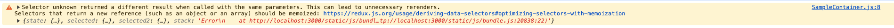
select관련 워닝이 발생하여 조사해본결과
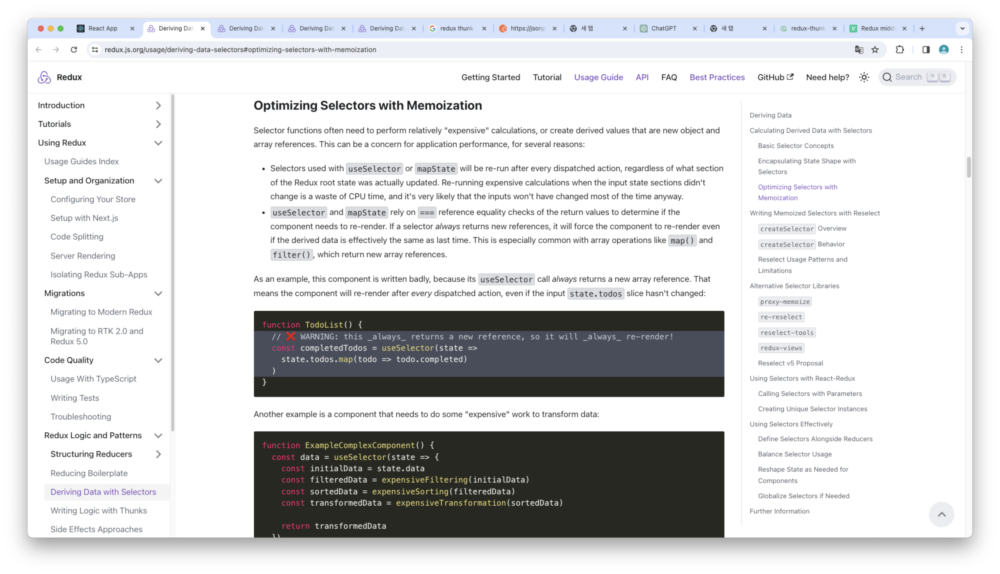
메모이제이션을 사용하라고 하여 사용했지만 워닝은 계속되었다

```javascript
import React, { useEffect } from "react";
import { useDispatch, useSelector } from "react-redux";
import Sample from "../components/Sample";
import { getPost, getUsers } from '../modules/sample'

const SampleContainer = () => {

   const { loadingPost, loadingUsers, post, users } = useSelector(state => {
      const ret = {
         loadingPost: state.sample.GET_POST,
         loadingUsers: state.sample.GET_USERS,
         post: state.sample.post,
         users: state.sample.users
      }
      return ret;
   });

   const dispatch = useDispatch();

   const onClick = () => {
      dispatch(getPost(1));
      dispatch(getUsers(1));
   }

   console.log(post, users, loadingPost, loadingUsers);

   return (
      <Sample loadingPost={loadingPost} loadingUsers={loadingUsers}
      post={post} users={users} onClick={onClick}></Sample>
   )
}

export default SampleContainer;
```

useSelector를 통해 loadingPost등 여러 값들을 전달 받았다.


이 부분에서 시간을 많이 소비하였다.
교재에서 제공한 코드는 다음과 같았다.
```javascript
const dispatch = useDispatch();

   const onClick = () => {
      getPost(1);
      getUsers(1);
   }
```

getPost(1)함수는 thunk function이다 이는 dispatch를 매개변수로 받는 함수를 반환하며 함수 실행을 하지 않는다.
getUsers(1)도 마찬가지이다.
요청조차 하지 않았기에 모든코드를 여러번 확인해본 결과 이 부분이 문제라고 판단했다.
이전에 예제에서 thunk함수를 dispatch로 호출한 것을 확인하여

다음과 같이 수정하였다.

```javascript
const dispatch = useDispatch();

   const onClick = () => {
      dispatch(getPost(1));
      dispatch(getUsers(1));
   }
```

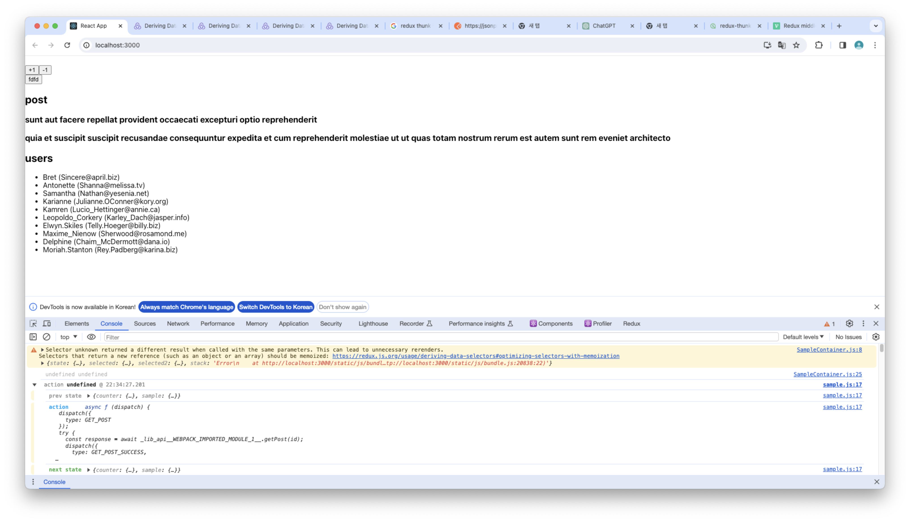

버튼을 누르니 정상적인 요청이 되었다.
따라서 thunk function을 dispatch하지 않아 요청조차하지 않았던 것이었다.

#### sample component작성
```javascript
import React from "react";

function Sample({ loadingPost, loadingUsers, post, users, onClick}) {
   return(
      <div>
         <button onClick={onClick}>fdfd</button>
         <section>
            <h1>post</h1>
            {
               loadingPost && 'loading...'
            }
            {
               !loadingPost && post && (
                  <div>
                     <h3>{post.title}</h3>
                     <h3>{post.body}</h3>
                  </div>
               )
            }
         </section>
            
         <section>
            <h1>users</h1>
            {
               loadingUsers && 'loading...'
            }
            {
               !loadingUsers && users && (
                  <ul>
                     {
                        users.map(user => (
                           <li key={user.id}>
                              {user.username} ({user.email})
                           </li>
                        ))
                     }
                  </ul>
               )
            }
         </section>
      </div>
   )
}

export default Sample;
```

loading의 여부에 따라서 로딩문자열을 출력하거나 응답받은 내용을 출력한다.