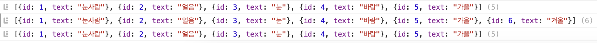
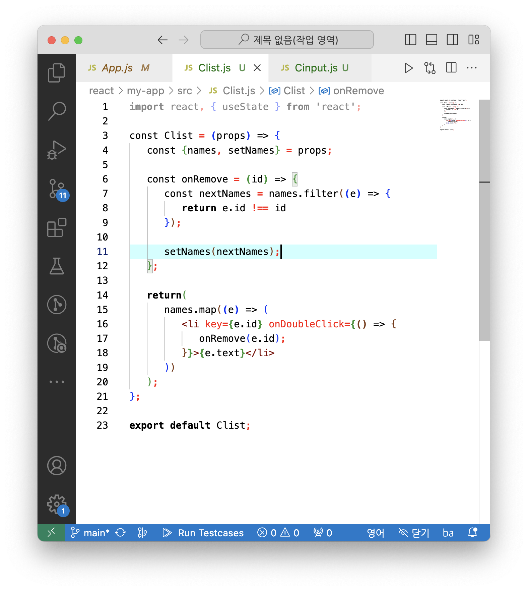

# 😀 리액트 챕터별 주요내용 정리

## 2장 JSX

### ⛑️ import 구문으로 특정파일을 불러올 수 있다.

```javascript
import logo from './logo.svg';
import './App.css';
```

##### 이처럼 모듈을 불러와서 사용하는 것은 원래 브라우저에 없던 기능이며 node.js에서 지원하는 기능이다.

node.js에서의 기능을 브라우저에서 사용할 수 있도록 bundler를 사용한다. 파일을 묶듯이 모듈들을 연결하는 것이다.

#### ⛓️ 대표적인 번들러
대표적인 번들러로는 웹팩, Parcel, browserify라는 도구들이 있다. 

##### react project에서는 webpack을 주로 사용한다.

#### 🤔 그러면 번들러를 왜쓸까?
프로젝트를 개발하면서 여러 모듈들을 불러오는데 불러온 모듈을 모두 합쳐서 하나의 파일을 생성할 수 있도록 해준다.
또한 최적화 과정에서 여러 개의 파일로 분리도 함


src/index.js를 시작으로 필요한 파일을 번들링함

#### 🤔 webpack을 왜씀

웹팩으로 svg, css파일등을 불러와서 사용가능하다. 이러한 파일들을 불러오는 것은 웹팩의 loader가 담당하는데 예를들어
css파일은 css-loader가 file-loader는 폰드등을 불러올 수 있으며 babel-loader는 최신 자바스크립트 문법으로 작성된 코드를 babel이라는 도구를 통해 ES5문법으로 변환해준다.

#### 🤔 왜 최신 js코드를 ES5로 변환하는가
결론부터 말하면 구버전 웹 브라우저와 호환하기 위해서이다. 또한 JSX는 자바스크립트 정식 문법이 아니므로 ES5형태로 변환해야한다.

#### 암튼 webpack은 CRA할때 알아서 설치 및 설정해준다.

### 👨‍🏫 JSX란 무엇인가
JSX는 자바스크립트 확장 문법이다. babel-bundler가 코드를 일반자바스크립트 형태(ES5형태)로 변환해준다.

```js
import logo from './logo.svg';
import './App.css';

function App() {
  return (
    <div className="App">
      <header className="App-header">
        
        <p>
          Edit <code>src/App.js</code> and save to reload.
        </p>
        <a
          className="App-link"
          href="https://reactjs.org"
          target="_blank"
          rel="noopener noreferrer"
        >
          Learn React
        </a>
      </header>
    </div>
  );
}

export default App;

```
얼핏보면 html코드인 것 같지만 내부적으로 일반 자바스크립트 코드로 변환해주는 과정이 있어 편하게 코딩이 가능하다.

### index.js에서의 root와 root.render
```js
const root = ReactDOM.createRoot(document.getElementById('root'));
root.render(
  <React.StrictMode>
    <App />
  </React.StrictMode>
);

```

root는 렌더링 할 곳이며 root.render내부의 컴포넌트는 렌더링 할 대상이다.

### 🥃 간단한 문법, 규칙

#### 1. component 감싸기
```js
function App() {
  return (
    <div className="App">
      <h1>Hello, world!</h1>
    </div>
  );
}
```

##### 잘못된 예시)
```js
function App() {
  return (
      <h1>Hello, world1!</h1>
      <h1>Hello, world2!</h1>
  );
}
```
위 코드는 component를 부모요소로 감싸지 않았으므로 오류가 나타난다.

##### fragment이용하기
```js
import { Fragment } from 'react';
...
function App() {
  return (
    <Fragment>
      <h1>Hello, world1!</h1>
      <h1>Hello, world2!</h1>
    </Fragment>
  );
}
```

#### 2. DOM에 자바스크립트 표현삽입하기
```js
import logo from './logo.svg';
import './App.css';
import { Fragment } from 'react';

function App() {
  const name = "리액트";
  return (
    <Fragment>
      <h1>Hello, world1!</h1>
      <h1>Hello, world2!</h1>
      <h2>{name}</h2>
    </Fragment>
  );
}

export default App;

```


모달 박스 만들기

modal 값이 off인 경우
```js
import logo from './logo.svg';
import './App.css';
import { Fragment } from 'react';

function App() {
  const modal = false;
  return (
    <Fragment>
      <h1>Hello, world1!</h1>
      <h1>Hello, world2!</h1>
      {modal ? <div>modal on</div> : <div>modal off</div>}
    </Fragment>
  );
}

export default App;

```


modal값이 on인 경우
```js
import logo from './logo.svg';
import './App.css';
import { Fragment } from 'react';
****
function App() {
  const modal = true;
  return (
    <Fragment>
      <h1>Hello, world1!</h1>
      <h1>Hello, world2!</h1>
      {modal ? <div>modal on</div> : <div>modal off</div>}
    </Fragment>
  );
}

export default App;

```


#### 3. undefind는 렌더링하면 오류가 발생한다.
```js
import logo from './logo.svg';
import './App.css';
import { Fragment } from 'react';

function App() {
  const modal = undefined;
  return modal;
}

export default App;

```
오류발생함!!

#### 4. 스타일링 하기

##### 인라인 스타일링
```js
import logo from './logo.svg';
import './App.css';
import { Fragment } from 'react';

function App() {
  const name = '리액트';

  const style = {
    backgroundColor: 'black',
    color: 'aqua',
    fontSize: '48px',
    fontWeight: 'bold',
    padding: 16,
  };

  return <div style={style}>{name}</div>
}

export default App;

```


##### 또는
```js
function App() {
  const name = '리액트';

  return <div style={{
    backgroundColor: 'black',
    color: 'aqua',
    fontSize: '48px',
    fontWeight: 'bold',
    padding: 16,
  }}>{name}</div>
}
```

#### 5. class 대신에 className사용

/App.css
```css
.react {
  background: aqua;
  color: black;
  font-size: 48px;
  font-weight: bold;
  padding: 16;
}
```

```js
import logo from './logo.svg';
import './App.css';
import { Fragment } from 'react';

function App() {
  const name = '리액트';

  return <div className="react">{name}</div>
}

export default App;

```

className을 사용하여 css사용가능


### 3. 컴포넌트(component)

#### component란?

컴포넌트는 틀이라고 생각해도 된다. 하지만 컴포넌트의 기능은 단순한 템틀릿 이상이다. 데이터가 컴포넌트에 주어졌을 때 UI를 구성하거나, 라이브사이클 API를 사용하여 컴포넌트가 화면에서 나타날 때, 화면에서 사라질 때, 변화가 일어날 때 주어진 작업들을 처리할 수 있다. 또한 임의의 메서드를 만들어 특별한 기능을 수행할 수 있게 할 수 있다.

#### 함수형 컴포넌트

(공부하고 있는 교재에는 클래스형 컴포넌트도 설명하지만 함수형 컴포넌트로 바꿔서 작성하겠다)
위의 설명에서 데이터가 컴포넌트에 주어졌을 때 UI를 구성한다고 했다. 컴포넌트가 데이터를 제공받을 때엔 props와 state를 사용한다.

##### 자바스크립트 ES6내용
자바스크립트의 클래스는 문법적 설탕이다. 클래스는 내부적으로 생성자함수에 의해 객체를 생성하며 생성자함수의 동작과 동일하다.

화살표함수(arrow function)는 함수를 표현하는 새로운 방식이다. 일반 함수가 가리키는 this는 전역스코프이거나 메서드인 경우엔 속해있는 객체이지만, 화살표함수의 this는 상위스코프로 바인딩된다.

##### 컴포넌트 생성 후 export하기

```javascript
const MyComponent = () => {
   return (
      <div>
         나의 새롭고 멋진 컴포넌트
      </div>
   )
};

export default MyComponent;
```

##### 생성한 컴포넌트를 import하여 App.js에서 불러오기
```javascript
import './App.css';
import MyComponent from './MyComponent';

function App() {
  return(
    <MyComponent></MyComponent>
  )
}

export default App;

```


#### props는 properties의 준말이다. 자식 컴포넌트에 props를 전달하여 자식컴포넌트에서 props값을 이용하여 기능을 만들 수 있다.

##### 부모컴포넌트는 App.js이며 App.js에서 props를 전달하여 MyComponent에서 props값을 렌더링 해보겠다.


##### MyComponent Component에서는 props를 매개변수로 받아 name 프로퍼티를 통해 부모로부터 원하는 값을 얻는다.


##### default props를 통해 props값이 전달되지 않을때 default값을 지정해줄 수 있다.


##### parent component tag 사이에 있는 내용을 child component에서 props로 전달 받을 수 있다.


##### javascript object destructuring syntax을 이용하여 props값 받기


##### state 간단한 사용과 소개

교재에서는 클래스형 컴포넌트에서 state를 사용하는 예시가 나오지만 함수형 컴포넌트에서 useState를 통해 상태관리 코드를 간단하게 작성해보겠다.

##### 컴포넌트구조
   - App.js
     - Counter.js

App.js에서 count값을 관리하며 count state setter를 props로 counter에 전달하여 상태변경을 할 수 있도록 할 예정이다.

##### 1. App.js에서 useState를 사용하여 상태를 만들고 MyComponent 컴포넌트에 props로 값을 전달해준다.


##### 2. MyComponent에서 전달받은 props를 destructuring문법을 통해 setter를 받아 버튼에 이벤트핸들러에 연결해준다.


##### 3. 메서드 분리


## 4. 이벤트 핸들링
리액트의 이벤트 시스템은 html이벤트와 인터페이스가 동일하며 사용법이 유사하지만 몇개의 특징이 존재한다.
1. 이벤트 이름은 CamelCase이다. (onClick, onKeyUp...)
2. 이벤트에 실행할 함수 형태의 값을 전달한다. 이벤트 핸들러가 콜백함수를 실행하는 식으로 진행된다.
3. DOM요소에만 event를 설정할 수 있으며 custom component에 onClick전달시 props로 전달한다.

  - example
    예시에서는 onClick과 혼동할 우려가 있어 onClickUp이라고 했다.
    
    


## 5. 이벤트 종류
리액트에서 지원하는 대표적인 이벤트
- Clibboard
- Touch
- Composition
- UI
- Keyboeard
- Wheel
- Focus
- Media
- Form
- Image
- Mouse
- Animation
- Selection
- Transition

### 1. onChange 이벤트는 value가 변경되면 콜백함수를 호출하는 이벤트해들러이다.

input태그에서 onChange이벤트를 사용하여 값을 관리할 수 있다.
onChange에서 매개변수로 받은 이벤트를 e로 받아 e.target.value로 value값을 얻어 useState를 통해 상태관리를 할 수 있다.


- 버튼을 누르면 input value가 초기화 되고 alert하는 것을 구현해보자
  input tag의 value를 text와 연결한 후 button onClick event 발생 후에 onClick함수 실행하여 setText를 통해 text를 초기화한다.


### 2. 여러개의 input태그 사용하기
e.target.name으로 property name을 얻어 상태를 관리한다.


## 5. Ref사용하기

### 일반 html에서는 DOM요소에 이름을 달때 id를 사용한다.

```html
<div id="my-element"></div>
```

id를 가진 요소를 css를 통해 디자인하거나 자바스크립트에서 id를 통해 요소를 찾아 작업을 수행할 수 있다.

html에서 DOM에 id를 통해 네이밍을 할 수 있는 것 처럼 리액트 프로젝트 내부에서 DOM에 이름을 다는 방법이 ref개념이다.

### ref는 DOM을 꼭 직접적으로 건드려야 할 때 사용한다.
클래스형 컴포넌트에서 ref를 사용하는 예시는 작성하지 않겠다. 함수형 컴포넌트에서 ref사용은 후에 나올 때 작성하겠다.

## 6. 컴포넌트 반복
반복되는 코드를 작성할 때 다음과 같이 그냥 작성할 수 있을 것이다.
```html
<ul>
  <li>수학</li>
  <li>국어</li>
  <li>사회</li>
  <li>과학</li>
</ul>
```

일정한 형식에 맞춰 작성되는 반복되는 코드를 map함수를 사용하여 효율적으로 작성할 수 있다.

```javascript
function App() {
  const sub = ['수학', '국어', '사회', '과학'];

  return(
    <div>
      {sub.map(e => <li>{e}</li>)}
    </div>
  )
}
```

하지만 다음과 같은 경고 문구가 뜬다.


### key란 무엇인가
가령 생성한 dom각각에서 이벤트가 발생했을 때 변화를 감지하여 변화된 부분만 리렌더링을 할 것이다. 이는 key가 존재한다면 더 빠르게 진행되며 리스트의 각각의 자식 노드들은 key를 가져야 한다.

```javascript
function App() {
  const sub = ['수학', '국어', '사회', '과학'];

  return(
    <div>
      {sub.map((e, i) => <li key={i}>{e}</li>)}
    </div>
  )
}
```

key를 index로 지정하는 방식은 쓰이지 않지만 각 요소의 고유번호가 없으므로 인덱스로 지정하였다. 만약 배열의 순서가 바뀌거나 삭제되는 요소가 있다면 효율적으로 렌더링을 할 수 없다.

### 데이터를 추가하거나 삭제하는 기능을 개발해보자


#### 데이터 추가하는 기능 구현
App.js에서 전체 상태를 관리하도록 하였고 names의 getter와 setter를 props로 전달하여 다른 컴포넌트에서 사용하도록 하였다.

```javascript
App.js

import './App.css';
import react, { useState } from 'react';
import MyComponent from './MyComponent';
import Clist from './Clist';
import Cinput from './Cinput';

function App() {
  const [names, setNames] = useState([
    {id: 1, text: '눈사람'},
    {id: 2, text: '얼음'},
    {id: 3, text: '눈'},
    {id: 4, text: '바람'},
    ]);

  return(
    <div>
      <Clist names={names}></Clist>
      <Cinput names={names} setNames={setNames}></Cinput>

      <button onClick={() => {
        console.log(names);
      }}>현재 객체 출력하기</button>
    </div>
  )
}

export default App;
```
Clist는 App.js에서 받은 names를 렌더링하는 컴포넌트이다.
map함수를 사용하여 효율적으로 렌더링 한다.

```javascript
Clist.js

import react, { useState } from 'react';

const Clist = (props) => {
   const {names} = props;

   return(
      names.map((e) => (
         <li key={e.id}>{e.text}</li>
      ))
   ); 
};

export default Clist;
```

Cinput은 App.js에서 받은 setNames를 통해 입력받은 값을 이용하여 names를 수정한다.
수정된 names는 Clist에서 포착되어 추가된 부분만 재랜더링 된다.

```javascript
Cinput.js 

import react, { useState } from 'react';

const Cinput = (props) => {
   const {names, setNames} = props;

   const [inputText, setInputText] = useState('');
   const [nextId, setNextId] = useState(5);   

   const onChange = (e) => {
      setInputText(e.target.value);
   };

   const onClick = () => {
      const nextNames = [
         ...names,
         {id: nextId, text: inputText}
      ];

      setNames(nextNames);

      setNextId((s) => s + 1);
      setInputText('');
   }

   return(
      <div>
         <input type="text" value={inputText} onChange={onChange}></input>
         <button onClick={onClick}>+</button>
      </div>
   ); 
};

export default Cinput;
```
위 출력은 가을과 겨울을 순서대로 입력한 것이다.


객체의 상태는 console로 출력하도록 하여 확인하였다.


#### 삭제구현하기

map함수를 통해 li요소들을 렌더링 할때 이벤트를 추가하여 더블클릭시 삭제되도록 구현해보겠다.
따라서 Clist에 props로 setNames를 전달해 주어야 한다.


Clist.js


```javascript
import react, { useState } from 'react';

const Clist = (props) => {
   const {names, setNames} = props;

   const onRemove = (id) => {
      const nextNames = names.filter((e) => {
         return e.id !== id
      });

      setNames(nextNames);
   };

   return(
      names.map((e) => (
         <li key={e.id} onDoubleClick={() => {
            onRemove(e.id);
         }}>{e.text}</li>
      ))
   ); 
};

export default Clist;
```
이는 요소를 삭제한 뒤 객체의 상태를 출력한 것이다.




#### 전체 내용





### 7. 컴포넌트의 라이프사이클 메서드

컴포넌트를 처음 렌더링할 때 어떤 작업을 처리해야 하거나 컴포넌트를 업데이트하기 전후로 어떤 작업을 처리해야 할 수도 있고, 또 불필요한 업데이트를 방지해야 할 수도 있다.

컴포넌트의 라이프사이클 메서드는 클래스형 컴포넌트에서만 사용이 가능하다. 함수형 컴포넌트에서는 훅을 이용한다.

### 라이프사이클 메서드는 9종류가 있다.
라이프 사이클은 세가지 카테고리로 나뉜다.

1. 마운트
2. 업데이트
3. 언마운트

### 1. 마운트
DOM이 생성되고 웹 브라우저상에 나타나는 것을 마운트라고 한다.

#### 컴포넌트가 업데이트되는 네가지 경우
1. props가 바뀔 때
2. state가 바뀔 때
3. 부모 컴포넌트가 리렌더링 될 때 (자식 컴포넌트의 props가 바뀌지 않아도 부모 컴포넌트가 리렌더링 되면 자식 컴포넌트 또한 리렌더링 된다.)
4. this.forceUpdate로 강제로 렌더링을 트리거할 때
   
#### 업데이트할 때 호출하는 메서드
1. getDerivedStateFromProps: props의 변화에 따라 state값에도 변화를 주고 싶을 때 사용한다.
2. shouldComponentUpdate: 컴포넌트가 리렌더링을 해야 할지 말아야 할지를 결정하는 메서드이다. true반환시 다음 라이프사이클 메서드를 실행하며 false반환시 작업을 중단한다.
3. render: 컴포넌트를 리렌더링한다.
4. getSnapshotBeforeUpdate: 컴포넌트 변화를 DOM에 반영하기 바로 직전에 호출하는 메서드이다.
5. componentDidUpdate: 컴포넌트의 업데이트 작업이 끝난 후 호출하는 메서드이다.
   
### 2. 언마운트
마운트의 반대과정이다. DOM를 삭제하는 과정이다.

#### 언마운트할 때 호출하는 메서드
- componentWillUnmount: 컴포넌트가 웹브라우저상에서 사라지기 전에 호출하는 메서드이다.

함수형 컴포넌트에서 라이프사이클 메서드를 훅을 통해 사용하는 예시는 뒤에 나온다.

### 8. Hooks

- useState
  - useState는 가장 기본적인 Hook이며 가변적인 상태를 지닐 수 있게 해준다.

```javascript
function App() {
  const [value, setValue] = useState(0);

  return(
    <div>
      <p1>현재 카운터 값은 {value}</p1>
      <div>
        <button onClick={() => {
          setValue(value + 1);
        }}>+1</button>

        <button onClick={() => {
          setValue(value - 1);
        }}>-1</button>
      </div>
    </div>
  )
}
```

  - 여러 State사용도 가능하다
  
```javascript

import './App.css';
import react, { useState } from 'react';

function App() {
  const [name, setName] = useState('');
  const [age, setAge] = useState('');

  const onChangeName = (e) => {
    setName(e.target.value);
  }

  const onChangeAge = (e) => {
    setAge(e.target.value);
  }

  return(
    <div>
      <div>
        <input type="text" value={name} onChange={onChangeName}></input>
        <input type="text" value={age} onChange={onChangeAge}></input>
      </div>

      <div>
        <h2>{name}</h2>
        <h2>{age}</h2>
      </div>
    </div>
  )
}

export default App;

```


- useEffect는 리액트 컴포넌트가 렌더링될 때마다 특정 작업을 수행하도록 설정할 수 있는 Hook이다.

```javascript

import './App.css';
import react, { useEffect, useState } from 'react';

function App() {
  const [name, setName] = useState('');
  const [age, setAge] = useState('');

  const onChangeName = (e) => {
    setName(e.target.value);
  }

  const onChangeAge = (e) => {
    setAge(e.target.value);
  }

  useEffect(() => {
    console.log('렌더링이 완료되었습니다.');
    console.log({
      name,
      age
    })
  });

  return(
    <div>
      <div>
        <input type="text" value={name} onChange={onChangeName}></input>
        <input type="text" value={age} onChange={onChangeAge}></input>
      </div>

      <div>
        <h2>{name}</h2>
        <h2>{age}</h2>
      </div>
    </div>
  )
}

export default App;

```

마운트될 때만 실행하고 싶을 때 두 번째 파라미터로 비어있는 배열을 넣어 주면 된다. (화면에 처음 렌더링 될때만 실행된다.)

```javascript
useEffect(() => {
    console.log('마운트될 때만 실행됩니다.');
  }, []);
```

특정 값이 업데이트 될때만 실행하고 싶을 때 두 번째 파라미터로 배열에 deps를 넣어준다

```javascript
useEffect(() => {
    console.log(name);
  }, [name]);

  useEffect(() => {
    console.log(age);
  }, [age]);
```

언마운트 될때 실행할 함수(뒷정리함수라고도 함)
```javascript
useEffect(() => {
    console.log(age);

    return () => {
      console.log('clean up');
    }
  }, [age]);
```

하지만 언마운트 될때 뿐만 아니라 값이 업데이트 될때 업데이트 되기 직전에도 뒷정리함수가 호출된다. 오직 언마운트 될때만 뒷정리 함수가 호출되게 하기 위해선 deps를 빈배열로 전달해주면 된다.

```javascript
useEffect(() => {
  console.log(age);

  return () => {
    console.log('clean up');
  }
}, []);
```

### useReducer로 더 다양한 상황에 따라 다양한 상태를 업데이트하기

리듀서는 현재 상태, 그리고 업데이트를 위해 필요한 정보를 담은 액션값을 전달받아 새로운 상태를 반환하는 함수이다.

#### 리듀서를 이용해서 카운터를 구현해보자

```javascript

import './App.css';
import react, { useEffect, useReducer, useState } from 'react';

function reducer(state, action) { ///state와 action을 전달 받음
  ///action은 사용자가 dispatch로 전달함
  switch(action.type) {
    case 'INCREMENT':
      return {
        value: state.value + 1
      };

    case 'DECREMENT':
      return {
        value: state.value - 1
      };

    default:
      return state;
  }
}

const Counter = () => {
  const [state, dispatch] = useReducer(reducer, {
    value : 0
  });

  return (
    <div>
      <p>current state of value : {state.value}</p>

      <div>
        <button onClick={() => {
          dispatch({type : 'INCREMENT'});
        }}> + </button>

        <button onClick={() => {
          dispatch({type : 'DECREMENT'});
        }}> - </button>
      </div>
    </div>
  )
}

function App() {
  


  return(
    <div>
      <Counter></Counter>
    </div>
  )
}

export default App;
```

reducer라는 함수는 state(현재상태)와 action(사용자의 액션)을 전달 받는다. action은 사용자가 전달한 객체를 의미하며 그 객체에 타입을 넣어줘서 타입에 따른 상태를 업데이트한다. type이 아니여도 된다. 사용자는 dispatch에 객체를 전달해주어 reducer를 작동시킨다. 
```javascript
function reducer(state, action) { 
  switch(action.type) {
    case 'INCREMENT':
      return {
        value: state.value + 1
      };

    case 'DECREMENT':
      return {
        value: state.value - 1
      };

    default:
      return state;
  }
}
```

useReducer에는 custom reducer함수를 전달해주며 두번째 전달인자로 초기 객체정보를 전달해준다.
```javascript
const [state, dispatch] = useReducer(reducer, {
    value : 0
  });
```

### useReducer의 장점
컴포넌트업데이트 로직을 컴포넌트 바깥으로 빼낼 수 있다.


### react input tag 출력해보기
```javascript

import './App.css';
import react, { useEffect, useReducer, useState } from 'react';
import CustomInput from './CustomInput';


function App() {

  const onChange = (e) => {
    console.log(Object.getOwnPropertyDescriptors(e.target));
  }

  return(
    <div>
      <input name='test' onChange={onChange}></input>
      {/* <CustomInput></CustomInput> */}
    </div>
  )
}

export default App;
```


value필드는 input의 프로퍼티에 있지만 name은 보이지 않는다.

#### name필드가 없는 것에 대한 gpt의 해답
React에서 이벤트 핸들러에 전달되는 SyntheticEvent 객체는 원래의 DOM 이벤트를 감싼 객체로, 일부 DOM 이벤트의 속성을 포함하고 있습니다. 그러나 이 객체에는 name 속성이 직접적으로 존재하지 않습니다. 대신, React에서는 name 속성이 아니라 event.target.name의 형태로 사용되는 것이 일반적입니다.

### reducer를 이용하여 input상태 관리하기
```javascript
import { useReducer, useState } from "react";

function reducer(state, action) {
   return {
      ...state,
      [action.name] : action.value
   };
} ///action에 name과 value를 받으며 state내부에 name프로퍼티 해당하는 value를 업데이트한다

const CustomInput = () => {

  const [state, dispatch] = useReducer(reducer, {
    name : '',
    age: ''
  });

  const {name, age} = state; ///destructuring
  
  const onChange = (e) => {
    dispatch(e.target);
    ///input tag에서의 e.target은 input tag를 가리키며 이는 name field와 age field를 갖고있음
  }
      
  return (
      <div>
        <div>
            <input name="name" value={name} onChange={onChange}></input>
            <input name="age" value={age} onChange={onChange}></input>
        </div>

        <div>
            <h2>이름 : {name}</h2>
            <h2>나이 : {age}</h2>
        </div>
      </div>
  )
}

export default CustomInput;
```

#### 리듀서 함수 작성하기
action은 input자체를 전달 할 것이고 그 객체안에 name field와 value field를 이용하여 state를 업데이트 할 것이다.

```javascript
function reducer(state, action) {
   return {
      ...state,
      [action.name] : action.value
   };
}
```

#### 초기상태 작성
```javascript
const [state, dispatch] = useReducer(reducer, {
      name : '',
      age: ''
   });
```

#### onChange 함수 작성 및 리턴 작성

onChange함수에서는 e.target자체를 dispatch로 전달해준다.

```javascript
const onChange = (e) => {
      dispatch(e.target);
      ///input tag에서의 e.target은 input tag를 가리키며 이는 name field와 age field를 갖고있음
   }
   
   return (
      <div>
         <div>
            <input name="name" value={name} onChange={onChange}></input>
            <input name="age" value={age} onChange={onChange}></input>
         </div>

         <div>
            <h2>이름 : {name}</h2>
            <h2>나이 : {age}</h2>
         </div>
      </div>
   )
```

### 전체적인 과정 정리

1. 사용자가 이벤트를 발생시킬 때 dispatch를 통해 action을 전달함
2. reducer에서 action과 현재 상태인 state를 통해서 state를 업데이트함

사용자는 리듀서 함수를 작성하여 useReducer에 전달해줘야 하면 두번째 전달인자로 초기상태를 전달해준다. 이때 받은 state와 dispatch를 통해 reducer함수 작성 및 이벤트 핸들러 작성을 해야한다.


출처: https://velog.io/@line_jeong32/React-상태-관리


### useMemo를 통한 최적화 진행하기

간단한 평균계산기를 만들어보자
```javascript

import './App.css';
import react, { useEffect, useReducer, useState } from 'react';

const getAverage = (numbers) => {
  console.log('평균값 계산 중..');
  if(numbers.length === 0) {
    return 0;
  }
  const sum = numbers.reduce((a, b) => a + b);
  return sum / numbers.length;
};

const Average = () => {
  const [list, setList] = useState([]);
  const [number, setNumber] = useState('');

  const onChange = (e) => {
    setNumber(e.target.value);
  };

  const onInsert = (e) => {
    const nextList = [
      ...list, parseInt(number)
    ];
    setList(nextList);
    setNumber('');
  }

  return (
    <div>
      <div>avg : {getAverage(list)}</div>
      <input value={number} onChange={onChange}></input>

      <button onClick={onInsert}>add</button>
    </div>
  )
}

function App() {

  return(
    <div>
      <Average></Average>
    </div>
  )
}

export default App;
```


getAverage함수가 호출 될 때 마다 평균값 계산중이라는 문자열을 출력하게 했다
출력 결과를 보면 list가 수정 될때 뿐만 아니라 input이 수정될때도 getAverage함수가 호출 되는 것을 확인 할 수 있다. useMemo를 사용하면 렌더링 하는 과정에서 특정값이 바뀌었을 때만 연산을 실행하게 할 수 있다. 여기 예시에서는 list가 바뀌었을 때만 연산을 진행하게 할 수 있다.

```javascript
  const avg = useMemo(() => {
    return getAverage(list)
  }, [list]);

```


#### useCallback함수를 이용한 최적화

컴포넌트가 렌더링될 때 함수들도 재생성된다. onChange함수같은 경우에는 렌더링 될때마다 새로운 함수를 사용할 필요가 없다. 따라서 useCallback함수의 두번째 전달인자로 빈 배열을 전달하여 처음 렌더링 될때만 생성하고 그 이후에 새로운 함수를 생성하지 않게 할 수 있다.

```javascript
const onChange = useCallback((e) => {
    setNumber(e.target.value);
  }, []);
```

마찬가지로 onInsert함수는 list와 number를 사용하며 list와 number가 바뀌지 않는다면 새로운 함수를 생성할 필요가 없으므로 최적화를 진행한다 이때 deps에는 list와 number를 전달해준다.

```javascript
const onInsert = useCallback(() => {
    const nextList = [
      ...list, parseInt(number)
    ];
    setList(nextList);
    setNumber('');
  }, [list, number]);
```

주의할 점은 useCallback함수의 두번째 전달인자로 어떤 값이 바뀌었을 때 함수를 새로 생성해야 하는지 명시해야 한다.

### useRef를 통해서 포커스 이동하기

#### useRef의 명세

useRef returns a mutable ref object whose .current property is initialized to the passed argument (initialValue). The returned object will persist for the full lifetime of the component.

#### 사용명세


#### useRef 사용명세 정리

1. ref를 통해 DOM을 다룰 때 초기 값을 null로 하여 inputRef객체를 생성한다.
2. DOM element의 ref attribute에 inputRef객체를 전달한다.
3. inputRef.current를 통해서 element에 접근한다.

```javascript
const inputEl = useRef(null);

...

const onInsert = useCallback(() => {
    const nextList = [
      ...list, parseInt(number)
    ];
    setList(nextList);
    setNumber('');
    inputEl.current.focus();
  }, [list, number]);
```

#### useRef를 사용하여 로컬 변수 사용하기
useRef를 통해서 로컬변수를 변경할 수 있다. 이때 변경되어도 컴포넌트가 리렌더링 되지 않는 것을 유의해야 한다. 즉 렌더링과 관련없는 변수를 관리할 때 사용할 수 있다.

```javascript

import './App.css';
import react, { useCallback, useEffect, useMemo, useReducer, useRef, useState } from 'react';

const RefSample = () => {
  const id = useRef(1);
  const setId = (n) => {
    id.current = n;
  }

  const printId = () => {
    console.log(id.current);
  }

  const [value, setValue] = useState('');

  const onChange = useCallback((e) => {
    setValue(e.target.value);
  }, []);
  
  const onClick = () => {
    setId(value);
  }

  return (
    <div>
      {id.current}
      
      <input onChange={onChange}></input>
      <button onClick={onClick}>edit</button>
      <button onClick={() => {
        console.log(id.current);
      }}>print id</button>
    </div>
  )
}

function App() {
  
  return(
    <div>
      <RefSample></RefSample>
    </div>
  )
}

export default App;
```


위 출력을 보면 12로 수정해도 리렌더링을 하지 않는 것을 확인할 수 있다. 또한 출력하는 버튼을 눌렀을 때 수정된 id.current값을 얻을 수 있는 것도 확인할 수 있다. 따라서 리렌더링할 필요없는 로컬변수를 다룰 때 useRef를사용할 수 있다.

### custom Hook으로 input상태 관리하기

```javascript
import React, { useReducer } from "react";

function reducer(state, action) {
   return {
      ...state,
      [action.name] : action.value
   };
}

export default function useInput(initialForm) {
   const [state, dispatch] = useReducer(reducer, initialForm);

   const onChange = e => {
      dispatch(e.target);
   };

   return [state, onChange];
}
```

useInput함수는 전달받은 초기객체와 리듀서 함수를 통해서 state와 dispatch를 생성하고 onChange함수에서 dispatch를 통해서 이벤트 정보를 전달한다. App에서 사용하는 useInput함수는 현재상태와 이벤트시 호출할 콜백함수만 받으면 되므로 custom hook을 만들어 필요한 상태와 콜백함수만 사용할 수 있도록 하며 컴포넌트 바깥에서 상태를 관리하는 로직을 구현할 수 있다.

```javascript

import './App.css';
import react, { useCallback, useEffect, useMemo, useReducer, useRef, useState } from 'react';
import useInput from './useInput';

function App() {
  const [state, onChange] = useInput({
    name: '',
    age: '',
  });

  const {name, age} = state;

  return(
    <div>
      <input name='name' value={name} onChange={onChange}></input>
      <input name='age' value={age} onChange={onChange}></input>

      <div>
        <h2>{name}</h2>
        <h2>{age}</h2>
      </div>
    </div>
  )
}

export default App;
```

App에서는 state와 onChange만을 사용하여 상태관리를 할 수 있다.


### custom hook을 이용하여 counter구현하기

마찬가지로 useCounter는 상태와 콜백함수만 반환하여 App에서 state와 onClick만 받아 사용하게 했다.

```javascript
import React, { useReducer } from "react";

function reducer(state, action) {
   if(action.name === 'INCREMENT') {
      return {
         ...state,
         count: state.count + 1
      };
   } else if(action.name === 'DECREMENT') {
      return {
         ...state,
         count: state.count - 1
      };
   }
}

export default function useCounter(initialForm) {
   const [state, dispatch] = useReducer(reducer, initialForm);

   const onClick = (e) => {
      dispatch(e.target);
   }

   return [state, onClick];
}
```

```javascript

import './App.css';
import react, { useCallback, useEffect, useMemo, useReducer, useRef, useState } from 'react';
import useInput from './useInput';
import useCounter from './useCounter';

function App() {
  const [state, onClick] = useCounter({
    count : 0
  });


  return(
    <div>
      <h2>{state.count}</h2>
      <button name='INCREMENT' onClick={onClick}>+</button>
      <button name='DECREMENT' onClick={onClick}>-</button>
    </div>
  )
}

export default App;

```


상태관리 코드를 분리하여 컴포넌트구현에 집중할 수 있을 듯 하다

### 9. component styling
리액트에서 컴포넌트를 스타일링 하는 방식은 크게 4가지로 볼 수 있다.

1. general CSS
2. Sass
3. CSS module
4. styled-component

general CSS는 기본적인 방식이므로 생략하며 Sass는 충돌이 잦아 생략한다.

### styled-component

스타일드컴포넌트는 자바스크립트 파일안에서 스타일을 선언하는 방식이다.


설치
```
npm install styled-components
```

```javascript

import './App.css';
import react, { useCallback, useEffect, useMemo, useReducer, useRef, useState } from 'react';
import useInput from './useInput';
import useCounter from './useCounter';
import styled, { css } from 'styled-components';

const Box = styled.div`
  background: ${props => props.color || 'blue'};
  padding: 1rem;
  display: flex;
`;

const Button = styled.button`
  background: white;
  color: black;
  border-radius: 4px;
  padding: 0.5rem;
  display: flex;
  align-items: center;;
  justify-content: center;;
  box-sizing: border-box;
  font-size: 1rem;
  font-weight: 600;

  &:hover { /// &문자를 사용하여 자기 자신 선택
    background: rgba(255, 255, 255, 0.9);
  }

  ${
    props => props.inverted && css`
      background: none;
      border: 2px solid white;
      color: white;

      &:hover {
        background: white;
        color: black;
      }
    `
  };

  & + button {
    margin-left: 1rem;
  }
`;


function App() {
  

  return(
    <div>
      <Box color='black'>
        <Button>Hi</Button>
        <Button inverted={true}>outline</Button>
      </Box>
    </div>
  )
}

export default App;

```


styled-component에서는 props로 전달한 값들을 디자인할 때 사용할 수 있다는 것이다.

```javascript
const Box = styled.div`
  background: ${props => props.color || 'blue'};
  padding: 1rem;
  display: flex;
`;
...
<Box color='black'>
        <Button>Hi</Button>
        <Button inverted={true}>outline</Button>
      </Box>
```

**Box컴포넌트를 사용할 때 props로 받은 color값을 이용하여 background값을 지정할 수 있다.**

```javascript
&:hover { /// &문자를 사용하여 자기 자신 선택
    background: rgba(255, 255, 255, 0.9);
  }
```

버튼컴포넌트를 보면 자기자신을 선택할 수 있는 &를 이용하여 hover시에 background를 변경한다.

```javascript
${
    props => props.inverted && css`
      background: none;
      border: 2px solid white;
      color: white;

      &:hover {
        background: white;
        color: black;
      }
    `
  };
```

또한 props로 전달받은 inverted값이 true인경우에 대해서 다른 스타일을 적용한다. 이때 css``를 통해서 새로운 스타일들을 적용한다. 이는 tagged template literal이며, 이를 사용하지 않으면 그냥 문자열로 인식한다.

사용해야할 태그명이 유동적이거나 특정 컴포넌트 자체에 스타일링해 주고 싶다면 styled(component)형태로 구현이 가능하다

```javascript

import './App.css';
import react, { useCallback, useEffect, useMemo, useReducer, useRef, useState } from 'react';
import useInput from './useInput';
import useCounter from './useCounter';
import styled, { css } from 'styled-components';

const Box = styled.div`
  background: ${props => props.color || 'blue'};
  padding: 1rem;
  display: flex;
`;

const Button = styled.button`
  background: white;
  color: black;
  border-radius: 4px;
  padding: 0.5rem;
  display: flex;
  align-items: center;;
  justify-content: center;;
  box-sizing: border-box;
  font-size: 1rem;
  font-weight: 600;

  &:hover { /// &문자를 사용하여 자기 자신 선택
    background: rgba(255, 255, 255, 0.9);
  }

  ${
    props => props.inverted && css`
      background: none;
      border: 2px solid white;
      color: white;

      &:hover {
        background: white;
        color: black;
      }
    `
  };

  & + button {
    margin-left: 1rem;
  }
`;

const CustomComponent = ({className}) => {
  return(
    <h2 className={className}>hello</h2>
  );
};

const StyledCustomComponent = styled(CustomComponent)`
  font-size: 2rem;
`

function App() {
  

  return(
    <div>
      {/* <Box color='black'>
        <Button>Hi</Button>
        <Button inverted={true}>outline</Button>
      </Box> */}

      <StyledCustomComponent></StyledCustomComponent>
    </div>
  )
}

export default App;
```

위 예시에서 className을 받아서 전달해주기만 하면 styled에 다양한 컴포넌트를 전달할 수 있다.

### 반응형 디자인
브라우저의 가로 크기에 따라서 다른 스타일을 적용하기 위해서 media쿼리를 사용한다.

```javascript
const Box = styled.div`
  background: ${props => props.color || 'blue'};
  padding: 1rem;
  display: flex;

  width: 1024px;
  margin: 0 auto;
  @media (max-width: 1024px) {
    width: 768px;
  }

  @media (max-width: 768px) {
    width: 100%;
  }
`;
```

1024이상


768미만


