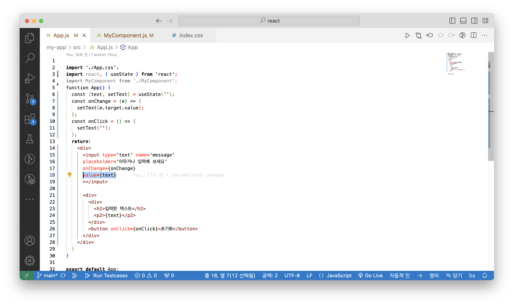

# 😀 리액트 챕터별 주요내용 정리

## 2장 JSX

### ⛑️ import 구문으로 특정파일을 불러올 수 있다.

```javascript
import logo from './logo.svg';
import './App.css';
```

##### 이처럼 모듈을 불러와서 사용하는 것은 원래 브라우저에 없던 기능이며 node.js에서 지원하는 기능이다.

node.js에서의 기능을 브라우저에서 사용할 수 있도록 bundler를 사용한다. 파일을 묶듯이 모듈들을 연결하는 것이다.

#### ⛓️ 대표적인 번들러
대표적인 번들러로는 웹팩, Parcel, browserify라는 도구들이 있다. 

##### react project에서는 webpack을 주로 사용한다.

#### 🤔 그러면 번들러를 왜쓸까?
프로젝트를 개발하면서 여러 모듈들을 불러오는데 불러온 모듈을 모두 합쳐서 하나의 파일을 생성할 수 있도록 해준다.
또한 최적화 과정에서 여러 개의 파일로 분리도 함


src/index.js를 시작으로 필요한 파일을 번들링함

#### 🤔 webpack을 왜씀

웹팩으로 svg, css파일등을 불러와서 사용가능하다. 이러한 파일들을 불러오는 것은 웹팩의 loader가 담당하는데 예를들어
css파일은 css-loader가 file-loader는 폰드등을 불러올 수 있으며 babel-loader는 최신 자바스크립트 문법으로 작성된 코드를 babel이라는 도구를 통해 ES5문법으로 변환해준다.

#### 🤔 왜 최신 js코드를 ES5로 변환하는가
결론부터 말하면 구버전 웹 브라우저와 호환하기 위해서이다. 또한 JSX는 자바스크립트 정식 문법이 아니므로 ES5형태로 변환해야한다.

#### 암튼 webpack은 CRA할때 알아서 설치 및 설정해준다.

### 👨‍🏫 JSX란 무엇인가
JSX는 자바스크립트 확장 문법이다. babel-bundler가 코드를 일반자바스크립트 형태(ES5형태)로 변환해준다.

```js
import logo from './logo.svg';
import './App.css';

function App() {
  return (
    <div className="App">
      <header className="App-header">
        
        <p>
          Edit <code>src/App.js</code> and save to reload.
        </p>
        <a
          className="App-link"
          href="https://reactjs.org"
          target="_blank"
          rel="noopener noreferrer"
        >
          Learn React
        </a>
      </header>
    </div>
  );
}

export default App;

```
얼핏보면 html코드인 것 같지만 내부적으로 일반 자바스크립트 코드로 변환해주는 과정이 있어 편하게 코딩이 가능하다.

### index.js에서의 root와 root.render
```js
const root = ReactDOM.createRoot(document.getElementById('root'));
root.render(
  <React.StrictMode>
    <App />
  </React.StrictMode>
);

```

root는 렌더링 할 곳이며 root.render내부의 컴포넌트는 렌더링 할 대상이다.

### 🥃 간단한 문법, 규칙

#### 1. component 감싸기
```js
function App() {
  return (
    <div className="App">
      <h1>Hello, world!</h1>
    </div>
  );
}
```

##### 잘못된 예시)
```js
function App() {
  return (
      <h1>Hello, world1!</h1>
      <h1>Hello, world2!</h1>
  );
}
```
위 코드는 component를 부모요소로 감싸지 않았으므로 오류가 나타난다.

##### fragment이용하기
```js
import { Fragment } from 'react';
...
function App() {
  return (
    <Fragment>
      <h1>Hello, world1!</h1>
      <h1>Hello, world2!</h1>
    </Fragment>
  );
}
```

#### 2. DOM에 자바스크립트 표현삽입하기
```js
import logo from './logo.svg';
import './App.css';
import { Fragment } from 'react';

function App() {
  const name = "리액트";
  return (
    <Fragment>
      <h1>Hello, world1!</h1>
      <h1>Hello, world2!</h1>
      <h2>{name}</h2>
    </Fragment>
  );
}

export default App;

```


모달 박스 만들기

modal 값이 off인 경우
```js
import logo from './logo.svg';
import './App.css';
import { Fragment } from 'react';

function App() {
  const modal = false;
  return (
    <Fragment>
      <h1>Hello, world1!</h1>
      <h1>Hello, world2!</h1>
      {modal ? <div>modal on</div> : <div>modal off</div>}
    </Fragment>
  );
}

export default App;

```


modal값이 on인 경우
```js
import logo from './logo.svg';
import './App.css';
import { Fragment } from 'react';
****
function App() {
  const modal = true;
  return (
    <Fragment>
      <h1>Hello, world1!</h1>
      <h1>Hello, world2!</h1>
      {modal ? <div>modal on</div> : <div>modal off</div>}
    </Fragment>
  );
}

export default App;

```


#### 3. undefind는 렌더링하면 오류가 발생한다.
```js
import logo from './logo.svg';
import './App.css';
import { Fragment } from 'react';

function App() {
  const modal = undefined;
  return modal;
}

export default App;

```
오류발생함!!

#### 4. 스타일링 하기

##### 인라인 스타일링
```js
import logo from './logo.svg';
import './App.css';
import { Fragment } from 'react';

function App() {
  const name = '리액트';

  const style = {
    backgroundColor: 'black',
    color: 'aqua',
    fontSize: '48px',
    fontWeight: 'bold',
    padding: 16,
  };

  return <div style={style}>{name}</div>
}

export default App;

```


##### 또는
```js
function App() {
  const name = '리액트';

  return <div style={{
    backgroundColor: 'black',
    color: 'aqua',
    fontSize: '48px',
    fontWeight: 'bold',
    padding: 16,
  }}>{name}</div>
}
```

#### 5. class 대신에 className사용

/App.css
```css
.react {
  background: aqua;
  color: black;
  font-size: 48px;
  font-weight: bold;
  padding: 16;
}
```

```js
import logo from './logo.svg';
import './App.css';
import { Fragment } from 'react';

function App() {
  const name = '리액트';

  return <div className="react">{name}</div>
}

export default App;

```

className을 사용하여 css사용가능


### 3. 컴포넌트(component)

#### component란?

컴포넌트는 틀이라고 생각해도 된다. 하지만 컴포넌트의 기능은 단순한 템틀릿 이상이다. 데이터가 컴포넌트에 주어졌을 때 UI를 구성하거나, 라이브사이클 API를 사용하여 컴포넌트가 화면에서 나타날 때, 화면에서 사라질 때, 변화가 일어날 때 주어진 작업들을 처리할 수 있다. 또한 임의의 메서드를 만들어 특별한 기능을 수행할 수 있게 할 수 있다.

#### 함수형 컴포넌트

(공부하고 있는 교재에는 클래스형 컴포넌트도 설명하지만 함수형 컴포넌트로 바꿔서 작성하겠다)
위의 설명에서 데이터가 컴포넌트에 주어졌을 때 UI를 구성한다고 했다. 컴포넌트가 데이터를 제공받을 때엔 props와 state를 사용한다.

##### 자바스크립트 ES6내용
자바스크립트의 클래스는 문법적 설탕이다. 클래스는 내부적으로 생성자함수에 의해 객체를 생성하며 생성자함수의 동작과 동일하다.

화살표함수(arrow function)는 함수를 표현하는 새로운 방식이다. 일반 함수가 가리키는 this는 전역스코프이거나 메서드인 경우엔 속해있는 객체이지만, 화살표함수의 this는 상위스코프로 바인딩된다.

##### 컴포넌트 생성 후 export하기

```javascript
const MyComponent = () => {
   return (
      <div>
         나의 새롭고 멋진 컴포넌트
      </div>
   )
};

export default MyComponent;
```

##### 생성한 컴포넌트를 import하여 App.js에서 불러오기
```javascript
import './App.css';
import MyComponent from './MyComponent';

function App() {
  return(
    <MyComponent></MyComponent>
  )
}

export default App;

```


#### props는 properties의 준말이다. 자식 컴포넌트에 props를 전달하여 자식컴포넌트에서 props값을 이용하여 기능을 만들 수 있다.

##### 부모컴포넌트는 App.js이며 App.js에서 props를 전달하여 MyComponent에서 props값을 렌더링 해보겠다.


##### MyComponent Component에서는 props를 매개변수로 받아 name 프로퍼티를 통해 부모로부터 원하는 값을 얻는다.


##### default props를 통해 props값이 전달되지 않을때 default값을 지정해줄 수 있다.


##### parent component tag 사이에 있는 내용을 child component에서 props로 전달 받을 수 있다.


##### javascript object destructuring syntax을 이용하여 props값 받기


##### state 간단한 사용과 소개

교재에서는 클래스형 컴포넌트에서 state를 사용하는 예시가 나오지만 함수형 컴포넌트에서 useState를 통해 상태관리 코드를 간단하게 작성해보겠다.

##### 컴포넌트구조
   - App.js
     - Counter.js

App.js에서 count값을 관리하며 count state setter를 props로 counter에 전달하여 상태변경을 할 수 있도록 할 예정이다.

##### 1. App.js에서 useState를 사용하여 상태를 만들고 MyComponent 컴포넌트에 props로 값을 전달해준다.


##### 2. MyComponent에서 전달받은 props를 destructuring문법을 통해 setter를 받아 버튼에 이벤트핸들러에 연결해준다.


##### 3. 메서드 분리


## 4. 이벤트 핸들링
리액트의 이벤트 시스템은 html이벤트와 인터페이스가 동일하며 사용법이 유사하지만 몇개의 특징이 존재한다.
1. 이벤트 이름은 CamelCase이다. (onClick, onKeyUp...)
2. 이벤트에 실행할 함수 형태의 값을 전달한다. 이벤트 핸들러가 콜백함수를 실행하는 식으로 진행된다.
3. DOM요소에만 event를 설정할 수 있으며 custom component에 onClick전달시 props로 전달한다.

  - example
    예시에서는 onClick과 혼동할 우려가 있어 onClickUp이라고 했다.
    
    


## 5. 이벤트 종류
리액트에서 지원하는 대표적인 이벤트
- Clibboard
- Touch
- Composition
- UI
- Keyboeard
- Wheel
- Focus
- Media
- Form
- Image
- Mouse
- Animation
- Selection
- Transition

### 1. onChange 이벤트는 value가 변경되면 콜백함수를 호출하는 이벤트해들러이다.

input태그에서 onChange이벤트를 사용하여 값을 관리할 수 있다.
onChange에서 매개변수로 받은 이벤트를 e로 받아 e.target.value로 value값을 얻어 useState를 통해 상태관리를 할 수 있다.


- 버튼을 누르면 input value가 초기화 되고 alert하는 것을 구현해보자
  input tag의 value를 text와 연결한 후 button onClick event 발생 후에 onClick함수 실행하여 setText를 통해 text를 초기화한다.



### 2. 여러개의 input태그 사용하기
e.target.name으로 property name을 얻어 상태를 관리한다.


