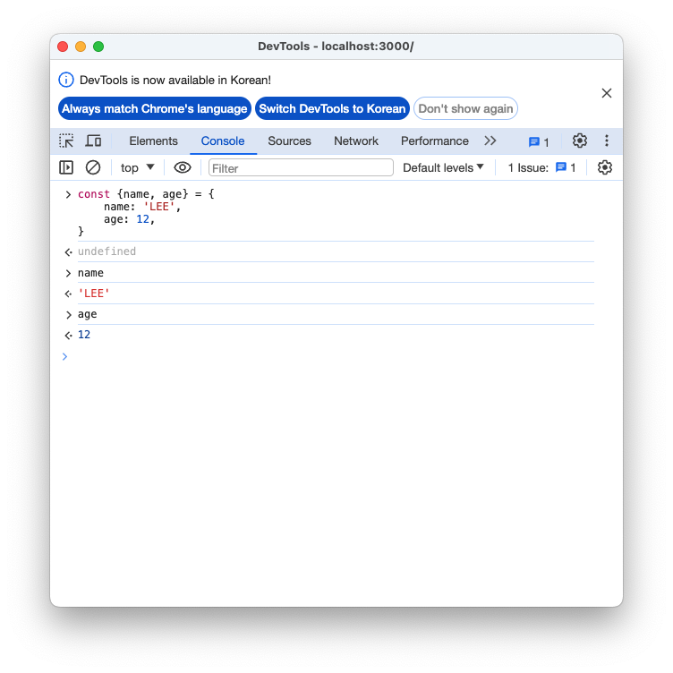

### cn
```
npm install classnames
```

```javascript
         <div className={cn('checkbox', {checked})}>
            {checked ? <IoCheckboxOutline /> : <MdCheckBoxOutlineBlank />}
            <div className="text">{text}</div>
         </div>
```

위의 예시와 같이 checked값이 true인 경우에 대해서 클래스 이름에 'checked'를 추가한다. 가령 minsu라는 변수의 값이 true라면 클래스 목록에 checkbox와 minsu로 된다.

#### true로 되어 클래스목록에 추가된 경우
```javascript
import React from "react";
import { MdCheckBoxOutlineBlank } from "react-icons/md";
import { IoCheckboxOutline } from "react-icons/io5";

import { MdRemoveCircleOutline } from "react-icons/md";
import './TodoListItem.css';
import cn from 'classnames';

const TodoListItem = ({todo}) => {
   const {text, checked} = todo;
   const MINSU = true;
   return (
      <div className="TodoListItem">
         <div className={cn('checkbox', {checked}, {MINSU})}>
            {checked ? <IoCheckboxOutline /> : <MdCheckBoxOutlineBlank />}
            <div className="text">{text}</div>
         </div>

         <div className="remove">
            <MdRemoveCircleOutline />
         </div>
      </div>
   )
}

export default TodoListItem;
```


#### false인 경우 클래스 목록에 추가되지 않음


### form에서 onSubmit을 사용하는 이유

그냥 button에 onClick을 넣어서 todo를 추가하도록 하여도 된다. 하지만 form에서는 enter key press를 감지하여 콜백함수를 실행하므로 onClick을 사용하지 않는다.

또한 button의 타입이 submit이므로 click시에 form의 onSubmit함수가 실행된다.

```javascript
...
   const onSubmit = useCallback((e) => {
      onInsert(value);
      setValue('');
      e.preventDefault();
   }, [onInsert, value]);

   return(
      <form className="TodoInsert" onSubmit={onSubmit}>
...
```


### React Dev Tools를 이용하여 렌더링 시간 확인하기


todolist를 만드는 과정에서 적은 데이터의 양에서는 렌더링 속도에 대한 고려를 하지 않지만 벌크데이터를 생성하여 렌더링을 한 후 엘리먼트를 삭제하거나 체크를 하는 경우 데이터가 적은 경우와 비교하여 렌더링시간이 매우 늘어난 것을 확인 할 수 있다. 따라서 추가적인 최적화가 필요해 보인다.

기존에 렌더링 후에 함수가 재생성되는 것을 방지하기 위해서 useCallback을 사용하여 최적화를 진행하였다.

### 느려지는 원인분석
1. 컴포넌트가 전달받은 props가 변경될 때
2. state가 바뀔 때
3. 부모 컴포넌트가 리렌더링 될 때
4. forceUpdate함수가 실행될 때

state가 수정이 될 경우 App.js에서 각 컴포넌트로 값을 뿌리는 과정에서 컴포넌트들이 받은 state가 수정되며 리렌더링이 된다. 하지만 리렌더링이 필요없는 요소들 까지도 리렌더링이 되면서 시간이 소요된다.

즉 리렌더링이 불필요할 때는 리렌더링을 방지해 주어야 한다.

함수형 컴포넌트에서 최적화를 진행하기 위해서 React.memo를 사용한다.

가령 TodoListItem에서 받은 todo에 대해서 수정된 경우에 대해서 리렌더링을 해야한다. 방법은 비교적 간단하다

```javascript
import React from "react";
import { MdCheckBoxOutlineBlank } from "react-icons/md";
import { IoCheckboxOutline } from "react-icons/io5";

import { MdRemoveCircleOutline } from "react-icons/md";
import './TodoListItem.css';
import cn from 'classnames';

const TodoListItem = ({todo, onRemove, onToggle}) => {
   const {text, checked, id} = todo;
   const MINSU = false;
   return (
      <div className="TodoListItem">
         <div className={cn('checkbox', {checked}, {MINSU})}
            onClick={() => {
               onToggle(id);
            }}
         >
            {checked ? <IoCheckboxOutline /> : <MdCheckBoxOutlineBlank />}
            <div className="text">{text}</div>
         </div>

         <div className="remove" onClick={() => {
            onRemove(id);
         }}>
            <MdRemoveCircleOutline />
         </div>
      </div>
   )
}

export default React.memo(TodoListItem);
```

export defualt 하는 부분을 React.memo로 감싸주기만 하면 된다.
```javascript
export default React.memo(TodoListItem);
```

이렇게 하면 컴포넌트가 받은 props들이 수정된 경우 대해서 리렌더링을 진행한다.

느려지는 원인 분석에서의 1번에 해당하는 props가 변경된 경우에 대해서 최적화를 진행한 것으로 보인다.

#### 최적화 후 시간 체크


왜 시간이 늘어났는지는 모르겠지만 최적화를 진행하긴 하였다.

### onToggle, onRemove함수가 바뀌지 않게 하기
기존에 setTodos함수를 사용할 때 파라미터를 전달받지 않고 우리가 새로 생성한 객체를 전달하면서 todos를 업데이트 하였다. 여기서 기존의 state를 setTodos에서 받아 새로운 객체를 생성하는 것이 아니라 기존의 객체에 추가한다면 최적화가 될 것이다. 또한 deps부분을 비워주면서 초기에만 생성되고 이후에 재생성되지 않도록 한다.

다음은 onRemove함수를 초기 렌더링에만 생성한 후 이후에 생성되지 않도록 deps를 비워주며 setTodos에서 기존의 state인 todos를 입력받아 filter를 통해 수정하는 예시이다

```javascript
const onRemove = useCallback((id) => {
    setTodos((todos) => (
      todos.filter(todo => todo.id !== id)
    ));
  }, []);
```


### todoReducer로 상태관리를 편리하게 진행하기

todoReducer는 현재 상태와 action을 전달 받는다. action은 useReducer로 생성한 state와 dispatch함수 중 dispatch함수에 전달한 객체이다. 가령 요소를 삭제하고 싶을 때 action.type은 'REMOVE'이며 action객체에는 id정보도 전달한다. 이를 todoReducer함수에서 action.type에 따른 분기를 진행하여 id값에 해당하는 요소를 filter를 거쳐서 삭제한다.


다음은 dispatch함수에 객체를 전달했을 때 타입에 따른 action객체의 명세이다.

```javascript
action's specification
    type : 'INSERT' | 'REMOVE' | 'TOGGLE

    case INSERT
    type: 'INSERT',
    todo: {
      id: 1,
      text: 'todo',
      checked: false
    }

    case REMOVE
    type: 'REMOVE',
    id: [number],

    case TOGGLE
    type: 'TOGGLE',
    id: [number],
```

case가 'INSERT'인 경우에 대해서 action객체에는 type과 todo prop가 있다. todo는 onInsert함수에서 TodoInsert컴포넌트에서 관리하는 state값을 통해 추가할 todo객체를 생성하여 todo에 넣어주고 type은 수기로 'INSERT'라고 작성해준다.

다음은 INSERT하는 예시이다.

```javascript
function todoReducer(todos, action) {
  ...
  switch(action.type) {
    case 'INSERT':
      return todos.concat(action.todo);
   ...
```

todoReducer 리듀서함수는 useReducer함수에서 리듀서 함수로 연결되어 상태관리할 때 사용할 수 있으며 전달받은 todos라는 state를 action상태에 따라 수정하여 반환한다.

다음은 리듀서함수의 전문이다.
```javascript
function todoReducer(todos, action) {
  switch(action.type) {
    case 'INSERT':
      return todos.concat(action.todo);

    case 'REMOVE':
      return todos.filter((todo) => (
        todo.id !== action.id
      ));

    case 'TOGGLE':
      return todos.map((todo) => (
        todo.id === action.id ? {
          ...todo,
          checked: !todo.checked
        } : todo
      ));
    defualt:
      return todos;
  }

}
```

action.type 이 'REMOVE'인 경우에 대해서는 action객체에 id값을 전달받아 todos를 filter한다.

action.type이 'TOGGLE'인 경우에 대해서는 action객체에 id값을 전달받아 todos중 id가 겹치는 요소에 대해서 checked값을 toggle한다.

### javascript에서의 불변성에 대해서


자바스크립트에서의 배열은 밀집배열이 아닌 희소배열이며 배열을 흉내낸 객체이다. 따라서 객체값을 deepcopy한 것이 아닌 shallowcopy를 한다.

array값이 수정되었을 때 nextArrayBad로 배열객체를 조회하였을 때 수정된 값을 확인할 수 있다. 

이를 통해 불변성을 위해서는 대입연산자로 배열을 할당하면 안된다는 것을 확인할 수 있다.


#### spread 문법을 통해 1차적인 deepcopy진행


다음 예시를 통해 알 수 있는 내용은 스프레드 문법을 통해서 객체를 할당한 경우는 딥카피가 된다는 것이다.

#### 객체리터럴 내부에서 스프레드 문법사용


### 객체 디스트럭처링 할당





